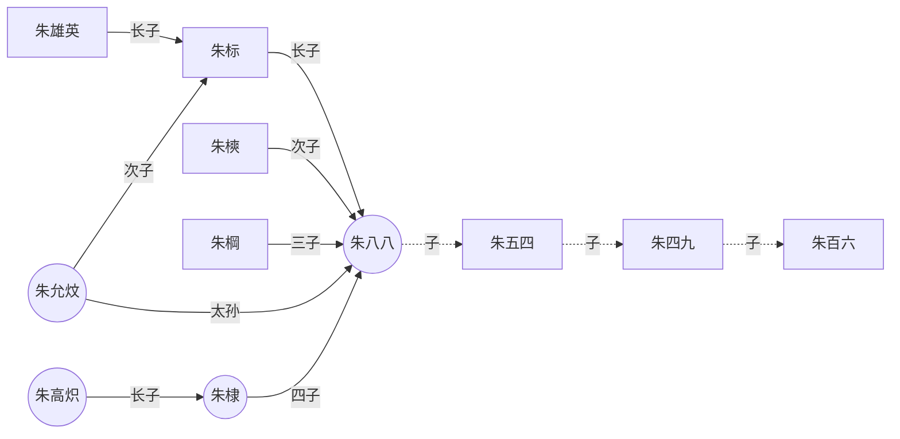
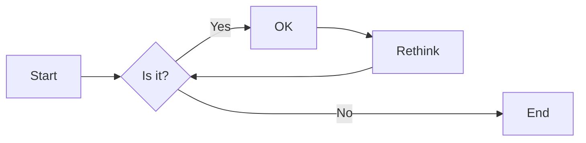
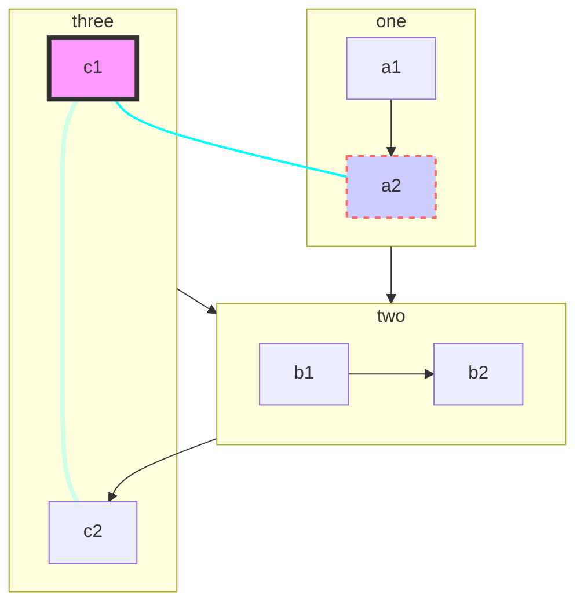
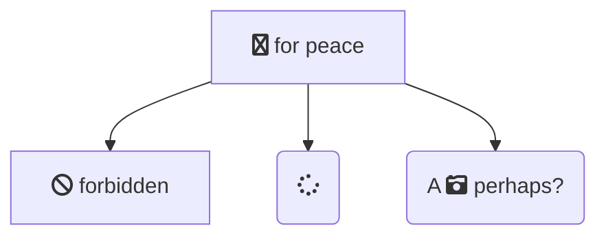
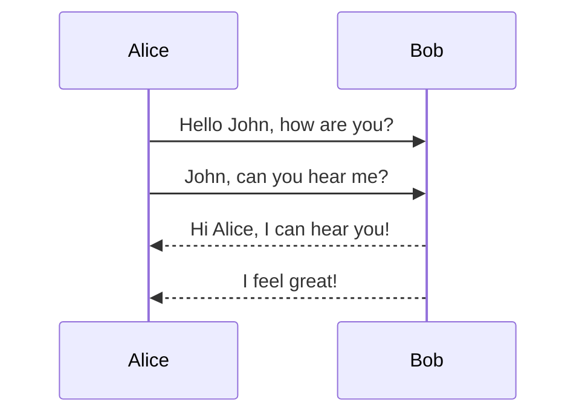
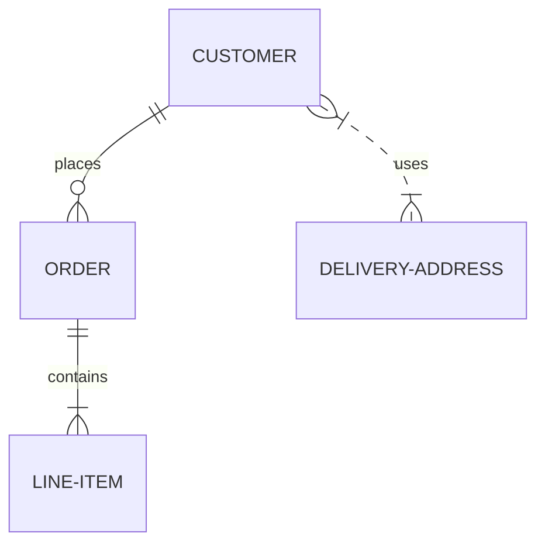
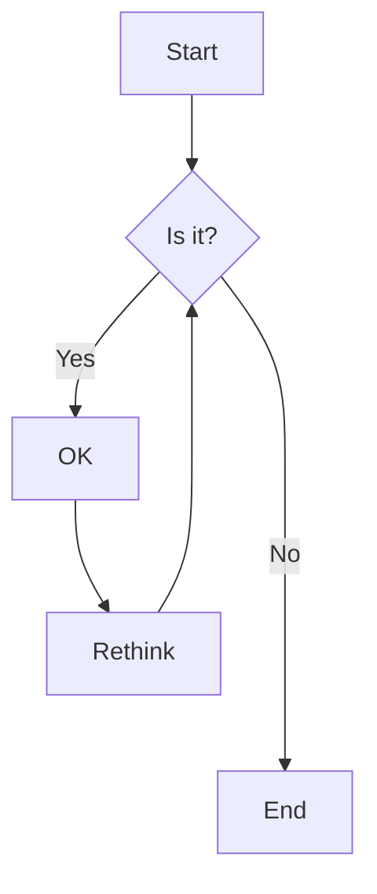
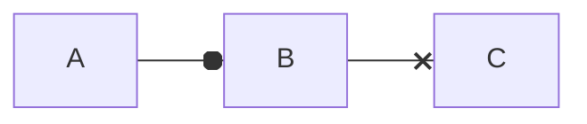
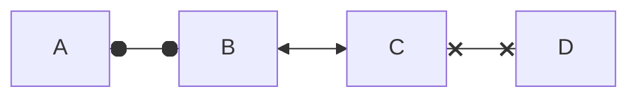

# Markdown 学习笔记 {ignore=true}

目录： 
<!-- @import "[TOC]" {cmd="toc" depthFrom=2 depthTo=3 orderedList=false} -->


## 一、Markdown的特点 {#cusome-title1}

人们要出版一本书，包括以下步骤

1. 作者创作
   关心书的具体内容，不关心如何排版
2. 编辑审稿
   编辑会找一些业内人氏，对具体内容的创新性、科学性，语言的逻辑性、准确性， 插图等进行评判，以决定是否出出版
3. 出版社出版
   对具体内容进行排版，并发回作者进行校对，决定出版物的具体形式。

分工是很明显的。对于创作者来说，关心的主要是出版物的具体内容。    
Markdown是一种专为创作者准备的轻量级标记语言，创作者在文档中能标出：[标题](#headers-%E6%A0%87%E9%A2%98)， [文字强调](#emphasis-%E6%96%87%E5%AD%97%E5%BC%BA%E8%B0%83)， [插入图片](#figures-%E6%8F%92%E5%85%A5%E5%9B%BE%E7%89%87)，[插入引用](#cite-%E5%BC%95%E7%94%A8)，[插入列表](#lists-%E6%8F%92%E5%85%A5%E5%88%97%E8%A1%A8)，[插入代码](#codes-%E6%8F%92%E5%85%A5%E4%BB%A3%E7%A0%81%E6%AE%B5), [插入公式](#math-%E6%8F%92%E5%85%A5%E5%85%AC%E5%BC%8F)， [插入流程图](#cusomeID-mermaid) 和 [建立链接](#link-%E9%93%BE%E6%8E%A5) 等必需的内容，其他与排版相关的东西,比如：目录，标题用什么字体、几号字，行间距，段间距等等，都交由出版社专业人员或程序（Markdown Preview）来完成。

## 二、Markdown 语法  {#cusome-title2}

### Headers (标题)  

标题用 “#+空格” 标记。 标题分为六级，由#的数目表示。比如用 “###+空格” 标出后面的内容是一个三级标题。

###  Emphasis (文字强调) 

用 “ \* ” 标记。强调分三种： 斜体 （" \* "），粗体（" \*\* "）， 斜粗体 （" \*\*\* "）

例如： *这是斜体*， **这是粗体**, ***这是斜粗体***

### Horizontal Rule （插入分隔线）

****

### Abbreviation (定义缩写)
*[HTML]: Hyper Text Markup Language
*[W3C]: World Wide Web Consortium
The HTML specification
is maintained by the W3C.
 
###  Cite（引用） 

分为文字引用，文献引用，代码引用和交叉引用等。

#### 文字引用
用 “ > ” 标记。例如: 习大大在XX大会上说：
>青年学生们一定要好好学习，XXXXXXXXXXXXXXXXX，XXXXXXXXXXX。我记得毛主席说过：
> >世界是你们的，也是我们的，但...

#### 文献引用

脚注: 采用的标记为 "\[^脚注+号码]". 这里引用的是脚注 [^脚注1] [^脚注2]
不管理以下脚注的内容放在哪里，都会显示在文档的最后，并与此处的引用位置建立了链接。
[^脚注1]: 作者名1，作者名2，文献名1，出版社，批号，页号，年份
[^脚注2]: 作者名1，作者名2，文献名2，出版社，批号，页号，年份

### Link (链接)

文字链接到网站, 比如：相关内容请查看[百度](https://www.baidu.com/)
链接到本地文件[我的学习总集合](learn_allin_notes.md)
文字链接到本文的某处[标题](#title-%E6%A0%87%E9%A2%98)
如图[Fig.2](Fig.2)所示
如图[Fig.1](@./figs/michel.png)所示

### Figures (插入图片)
插入本地图片  

插入网络图片   <a name="Fig.2"></a>
 


### Lists (插入列表)

#### Ordered List
1. First item
2. Second item
3. Third item
   1. subitem 
   2. subitem

#### Unordered List
- First item
- Second item
- Third item
  1. subitem
  2. subitem
- New item
  
#### Task List

- [x] Write the press release
- [x] Update the website
- [ ] Contact the media
- [ ] 

#### Definition List

牛顿第一定律
: 物体不受力时，总是保持匀速进线运动或静止状态

### Mark

==marked==

### Strikethrough 

~~The world is flat.~~ But we know it is not true   
<u>带下划线文本</u>


### Table (插入表格) 

| Syntax    | Description |
|    --- |    --- |
| Header    | Title       |
| Paragraph | Text        |
| 	    | Text        |

设置表格的对齐方式：

---: 设置内容和标题栏居右对齐。 
:--- 设置内容和标题栏居左对齐。 
:---: 设置内容和标题栏居中对齐。 

| Syntax    | Description |
|    :--- |    :---: |
| Header    | Title       |
| Paragraph | Text        |
| 	^    | Text        |


### Admonition (插入警告块) 
!!! note This is the admonition title
    This is the admonition body

### CriticMarkup (插入评论块) 

- Addition {++ ++}
- Deletion {-- --}
- Substitution {~~  ~>  ~~}
- Comment {>> <<}
- Highlight {== ==}{>> <<}
  
>>dgfggfghghgfhghgfhg<<

### Codes (插入代码)
这是行内代码 `printf(x)` 

代码段
```javascript 
$(document).ready(function () {
    alert('RUNOOB');
});
```

```javascript {.line-numbers} 
$(document).ready(function () {
    alert('RUNOOB');
});
```

```javascript {highlight=2}
$(document).ready(function () {
    alert('RUNOOB');
    printf 
});
```

### Mermaid codes (插入流程图) {#cusomeID-mermaid}



```mermaid
graph TB %% comments
  %% Entity[Text]
  ID-1[Node 1]
  ID-2>Node 2]
  ID-3(Node 3 <br> text)
  
  %% Entity--Entity
  ID-1---ID-2
  ID-1 --> ID-3

  %% Entity--Text--Entity
  ID-2--23---ID-3
  ID-3--31-->ID-1
  ID-3 -- "Action from 3 to 2"--> ID-2

  %% Complex cases
  A[Hard edge] -->|Link text| B(Round edge)
  B --> C{Text}
  C -->|One| D[Text]
  A(A) --> B(B)
  C[/C/] --> D>D]

  %% class/classDef
  classDef blue fill:#08f,stroke:#fff;
  class ID-1 blue
  class ID-1,ID-2 red

  %% click
  click ID-1 "https://github.com" "Tooltip text" %% comments
  click ID-2 alert "Tooltip for a callback"
  %% subgraph
  subgraph A subgraph
    ID-4{Node 4}
    ID-5((fa:fa-spinner))
    ID-6["Node 6 (same #quot;shape#quot;)"]
    ID-4-.->ID-5
    ID-5 -. Action from 5 to 4 .-> ID-4
    ID-5==>ID-6
    ID-6 == Action from 6 to 5 ==> ID-5
  end
```



#### 图的类型

- 饼状图：pie   
- 流程图：graph   
- 时序图：sequenceDiagram 
- 甘特图：gantt 
- 类图：  classDiagram 
- 状态图：stateDiagram
- 旅程图：journey
- 实体-联系图: erDiagram


#### 方向：声明流程图的方向。

- graph或graph TB或graph TD：从上往下
- graph BT：从下往上
- graph LR：从左往右
- graph RL：从右往左

#### 结点(graph)

- 结点名-ID，
- 结束内容，括号里的内容
- 结点形态，由括号形态决定
  - 默认方形
  - id1[方形]
  - id2(圆边矩形)
  - id3([体育场形])
  - `id4[[子程序形]]`
  - id5[(圆柱形)]
  - id6((圆形))
  - id7<左角右方形]
  - id8{菱形}
  - id9{{六角形}}
  - id10[/平行四边形/]
  - id11[\反向平行四边形\]
  - id12[/梯形\]
  - id13[\反向梯形/]
  - id14[(Database)]
  
#### 连线(graph)

- 实线箭头
    - a-->b
    - a--ab-->b
    - a-->|ab| b
- 粗实线箭头
    - a==>b
    - a\==ab==>b
    - a==>|ab| b
- 虚线箭头
    - a-.->b
    - a-.ab.->b
- 无箭头连线
    - a--b
    - a-.-b
    - a== b
- 样式
  linkStyle 0 stroke:#0ff,stroke-width:2px;
  linkStyle 3 stroke:#ff3,stroke-width:4px;
  style id1 fill:#f9f,stroke:#333,stroke-width:4px
  style id2 fill:#ccf,stroke:#f66,stroke-width:2px,stroke-dasharray: 5, 5

#### 子图



#### 图标

使用 Font Awesome 图标, 语法: fa:icon class-name



其他实例: 1.时序图：











<body>
  <div class="mermaid">
    flowchart LR;
        A-->B;
        B-->C;
        C-->D;
        click A callback "Tooltip"
        click B "http://www.github.com" "This is a link"
        click C call callback() "Tooltip"
        click D href "http://www.github.com" "This is a link"
  </div>

  <script>
    var callback = function(){
        alert('A callback was triggered');
    }
    var config = {
        startOnLoad:true,
        flowchart:{
            useMaxWidth:true,
            htmlLabels:true,
            curve:'cardinal',
        },
        securityLevel:'loose',
    };

    mermaid.initialize(config);
  </script>
</body>

### Math (插入公式) 

公式块
```math
    \delta (x)=
    \begin{cases} 
    1, &  \text{if} x = 0  \\  
    0, &  \text{if} x \neq 0   
    \end{cases}
```
#### 行内公式与行间公式

行内 $a^2+b^2=c^2$ 公式

行间公式
$$
a^2+b^2=c^2
$$
 
#### \{ \} \text{} 和 \operatorname{}

${xyz}^{xyz}$, ${xyz}^xyz$,  $\operatorname{sin}(\theta)$ , $\sin(\theta)$,

$$
f(n)=n^n \quad \text{n$\in N^\ast$}
$$

#### 字符变大变小

$ \tiny x $, $\scriptsize x $, $\footnotesize x $, $\small x$, $\normalsize x$, $x$, $\large x$, $\Large x$, $\LARGE x$, $\huge x$, $\Huge x$, $\boldsymbol{\alpha 12bcEF}12bcEF$

#### 各种字体型

$\mathnormal  {abc123}$, $\mathrm  {abc123}$, $\mathit  {abc123}$, $\mathsf {abc123}$,$\mathtt  {abc123}$, $\mathfrak {  abc123}$, $\mathbb {  abc123}$, $\mathcal {abc123}$,$\mathscr {abc123}$, $\bold {abc123}$, $\bm {abc123}$

$\textcolor{red}{F=ma}$

$ \colorbox{red}{black on red} $

#### 空行与空格

用$\; or ~ or \, or \quad or \qquad or \space or \thinspace or \thickspace or \medspace or \: or \nobreakspace or \negthinspace or \negthickspace or \negmedspace$ 来产生空格

用$ \\  A  \newline A \\ $  进行换行

#### 括号

$\lang \phi\vert\psi \rang, \lfloor {abc} \rfloor, \lbrace {abc} \rbrace, \langle {ab} \rangle, \left( {abc} \right), \left[ {abc} \right], \lgroup {abc} \rgroup, \lang {abc} \rang, \lt {abc} \gt, \{ {abc} \},| \frac{a}{b} |, \|\frac{a}{b} \|,| \dfrac{a}{b} |, \|\dfrac{a}{b} \|$

$\tbinom{n}{k}$,$\binom{n}{k}$,$\dbinom{n}{k}$,${n\brace k}$,${n\choose k}$,${n\brack k}$

$$
\Bigg \{
    \bigg \{
        \Big \{
            \big \{
                    \dfrac{a}{b}
            \big \}
        \Big \}
    \bigg \}
\Bigg \}
$$

$$
a = \left(1 + 2 + 3 + \cdots\right. \\ \qquad \left. n - 2 + n - 1 + n\right.)
$$

$$
\left. f(x)\middle |_{x=0} \right.
$$

#### 上下关系

${1}\over{xyz\over{x}}$， $x \atop y$，$\stackrel{x}{y}$, $\overset{x}{y}$, $\underset{x}{y}$, $a\raisebox{0.25em}{b}c$,

$ \displaystyle \sum_{i=1}^N $

#### 分数

$\tfrac{s}{m},\frac{s}{m},\dfrac{s}{m},\cfrac{s}{m} $

#### 点和头

$ 
\ldots, \dots, \cdots, \vdots, \ddots 
$

$ 
a^{\prime}, \bar{a}, \breve{a}, \dot{a}, \ddot{a}, \hat{a}, \widehat{ace}, \mathring{A},  \vec{F}=m\vec{a}
$ 

#### 数学推导

$\rArr$，$\rarr$，$\lrArr$，$\lrarr$，$\nRightarrow$，$\nLeftarrow$，$\nLeftrightarrow$，$\implies$， $\xRightarrow[under]{over}$，$\xrightarrow[under]{over}, \to, \propto, \approx $

$\because, \therefore, \forall, \And, \exists$

#### 求和，积分和极限

$$
\sum_{1 < i < N} {\frac {N-i+1}{i^{N-1}} }
$$

$$
\sum\limits_{i=1}^{N}{\frac {N-i+1}{i^{N-1}} }
$$

$\displaystyle \int_{0}^{\infty} f(x) dx $,

$\int_{0} ^{\infty} f(x) dx $,
$\displaystyle \int\limits_{0}^{\infty} f(x) dx $,

$\int\limits_{0}^{\infty} f(x) dx $,
$\smallint$, $\intop$, $\iint$, $\iiint$, $\oint$, $\oiint$, $\oiiint$

$\lim\limits_{i \to \infty} \dfrac{1}{i} = 0 $

#### 符号

$\times, \div, \mp, \pm, \oplus, \otimes, \equiv, \ne, \sim,\le, \ge, \gg, \ll, \geqq, \leqq, \pmod{a}, \mod{a},\centerdot, \bullet, \in, \ni, \cong, \gt, $
$\text{\sect}, \copyright, \bigtriangledown, \hbar, \ell, \yen, \degree, \angle, \infty, \ast,\star, \bigstar, \%$

$\alpha, \beta, \gamma, \delta, \epsilon, \zeta, \eta, \theta, \lambda, \mu, \nu,  \xi,  \pi, \rho, \sigma,  \tau, \upsilon, $

$\phi, \chi, \psi, \omega, \varphi, \varsigma, \varepsilon,  \nabla, \partial $

#### Define

$ \def\foo{x^2} \foo + \foo $

$ \gdef\bar#1{#1^2} \bar{x} + \bar{y}$

#### Direct Input:

§ ¶ £ ¥ ∇ ∞ · ∠ ∡ ∢ ♠ ♡ ♢ ♣ ♭ ♮ ♯ ✓ … ⋮ ⋯ ⋱ ! £ ¥ ∇ ∞ ⋅ ∠ ∡ ∢ ♠ ♡ ♢ ♣ ♭ ♮ ♯ ✓ … ⋮ ⋯⋱ ! ‼ ⦵
 
#### 矩阵

$$
\begin{matrix} 
1 & 2 & 3 \\   
2 & 3 & 4 \\   
4 & 5 & 6 \\  
\end{matrix}
$$

$$
\begin{pmatrix}  
1 & 2 & 3 \\   
2 & 3 & 4 \\  
4 & 5 & 6 \\  
\end{pmatrix}
$$

$$
\begin{bmatrix} 
1 & 2 & 3 \\ 
2 & 3 & 4 \\ 
4 & 5 & 6 \\ 
\end{bmatrix}
$$

$$
\begin{vmatrix} 
1 & 2 & 3 \\ 
2 & 3 & 4 \\ 
4 & 5 & 6 \\ 
\end{vmatrix}
$$

$$
\begin{Vmatrix} 
1 & 2 & 3 \\   
2 & 3 & 4 \\   
4 & 5 & 6 \\   
\end{Vmatrix}
$$

#### 数组、数表、方程组

$$
\begin{array}{lcr} 
1 & 2 & 3 \\ 
2 & 3 & 4 \\ 
4 & 5 & 6 \\ 
\end{array}
$$

$$
\begin{array}{l|crlc:r} 
1 & 2 & 3 & 1 & 2 & 3 \\ \hline
2 & 3 & 4 & 2 & 3 & 4 \\ 
4 & 5 & 6 & 4 & 5 & 6 \\ \hline \hline
4 & 5 & 6 & 4 & 5 & 6 \\ 
\end{array}
$$

$$
\left \{
\begin{array}{l} 
a_1x+b_1y+c_1=0  \\ 
a_2x+b_2y+c_2=0  \\ 
a_3x+b_3y+c_3=0   
\end{array}
\right.
$$

#### 条件式

$$
\delta (x)=
\begin{cases} 
1, &  \text{if} x = 0  \\  
0, &  \text{if} x \neq 0   
\end{cases}
$$

#### 一般公式、多行公式对齐及公式编号

$$
\begin{equation}
x^2+y^2=1
\end{equation}
$$

$$
x^2+y^2=1 \tag{1}
$$

$$
\begin{aligned}
 a &= a+c \\
   &= a+b+d 
\end{aligned}
$$

$$
\left \{
\begin{alignedat}{3}
 10 &x +3 &&y =20 \\
  8 &x +13 &&y = 8 
\end{alignedat}
\right.
$$

## 三、Markdown+MPE 制作 PPT {#cusome-title3}

Markdown Preview Enhanced (MPE) uses reveal.js to render beautiful presentations.

### Front matter rendering option
有关PPT的渲染选项放在文件开头部分， 主要包括：长-宽比，主题，转场动画等方面的设置  

>```
    ---
    title: AS
    subtitle: AS
    author: AS
    date: YYYY-MM-DD
    presentation:
        width: 800
        height: 600
        theme: black.css
        transition: slide
        backgroundTransition: concave
    ---

    <!-- slide -->

    Your slides goes here...

>```

#### Settings

>```
    ---
    presentation:
      # presentation theme
      # === available themes ===
      # "beige.css"
      # "black.css"
      # "blood.css"
      # "league.css"
      # "moon.css"
      # "night.css"
      # "serif.css"
      # "simple.css"
      # "sky.css"
      # "solarized.css"
      # "white.css"
      # "none.css"
      theme: white.css

      # The "normal" size of the presentation, aspect ratio will be preserved
      # when the presentation is scaled to fit different resolutions. Can be
      # specified using percentage units.
      width: 960
      height: 700

      # Factor of the display size that should remain empty around the content
      margin: 0.1

      # Bounds for smallest/largest possible scale to apply to content
      minScale: 0.2
      maxScale: 1.5

      # Display controls in the bottom right corner
      controls: true

      # Display a presentation progress bar
      progress: true

      # Display the page number of the current slide
      slideNumber: false

      # Push each slide change to the browser history
      history: false

      # Enable keyboard shortcuts for navigation
      keyboard: true

      # Enable the slide overview mode
      overview: true

      # Vertical centering of slides
      center: true

      # Enables touch navigation on devices with touch input
      touch: true

      # Loop the presentation
      loop: false

      # Change the presentation direction to be RTL
      rtl: false

      # Randomizes the order of slides each time the presentation loads
      shuffle: false

      # 
      fragments: true

      # Flags if the presentation is running in an embedded mode,
      # i.e. contained within a limited portion of the screen
      embedded: false

      # Flags if we should show a help overlay when the questionmark
      # key is pressed
      help: true

      # Flags if speaker notes should be visible to all viewers
      showNotes: false

      # Number of milliseconds between automatically proceeding to the
      # next slide, disabled when set to 0, this value can be overwritten
      # by using a data-autoslide attribute on your slides
      autoSlide: 0

      # Stop auto-sliding after user input
      autoSlideStoppable: true

      # Enable slide navigation via mouse wheel
      mouseWheel: false

      # Hides the address bar on mobile devices
      hideAddressBar: true

      # Opens links in an iframe preview overlay
      previewLinks: false

      # Transition style
      transition: 'default' # none/fade/slide/convex/concave/zoom

      # Transition speed
      transitionSpeed: 'default' # default/fast/slow

      # Transition style for full page slide backgrounds
      backgroundTransition: 'default' # none/fade/slide/convex/concave/zoom

      # Number of slides away from the current that are visible
      viewDistance: 3

      # Parallax background image
      parallaxBackgroundImage: '' # e.g. "'https://s3.amazonaws.com/hakim-static/reveal-js/reveal-parallax-1.jpg'"

      # Parallax background size
      parallaxBackgroundSize: '' # CSS syntax, e.g. "2100px 900px"

      # Number of pixels to move the parallax background per slide
      # - Calculated automatically unless specified
      # - Set to 0 to disable movement along an axis
      parallaxBackgroundHorizontal: null
      parallaxBackgroundVertical: null

      # Parallax background image
      parallaxBackgroundImage: '' # e.g. "https://s3.amazonaws.com/hakim-static/reveal-js/reveal-parallax-1.jpg"

      # Parallax background size
      parallaxBackgroundSize: '' # CSS syntax, e.g. "2100px 900px" - currently only pixels are supported (don't use % or auto)

      # Number of pixels to move the parallax background per slide
      # - Calculated automatically unless specified
      # - Set to 0 to disable movement along an axis
      parallaxBackgroundHorizontal: 200
      parallaxBackgroundVertical: 50

      # Enable Speaker Notes
      enableSpeakerNotes: false
    ---
>```

### Customize Slide Style
You can add id and class to a specific slide like this:

> <!-- slide id="my-id" class="my-class1 my-class2" -->
Or if you only want to customize nth slide, modify your less file like this:

```
.markdown-preview.markdown-preview {
  // custom presentation style
  .reveal .slides {
    // modify all slides
  }

  .slides > section:nth-child(1) {
    // this will modify `the first slide`
  }
}
```

## 四、Markdown+VSCode-Reveal 制作 PPT {#cusome-title3}

VSCode Reveal lets you display a reveal.js presentation directly from an opened markdown document.

```---
theme : "night"
transition: "slide"
highlightTheme: "monokai"
logoImg: "logo.png"
slideNumber: false
title: "VSCode Reveal intro"
---
```
### References


