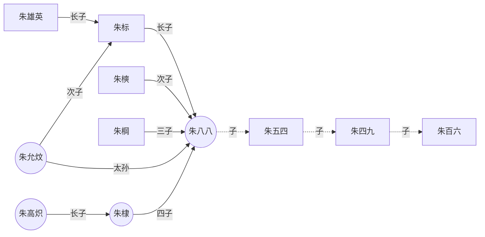
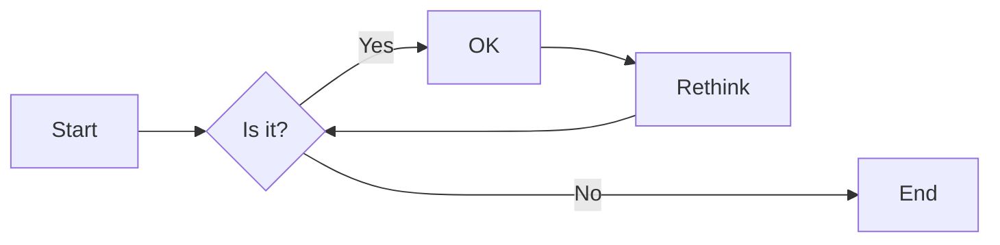
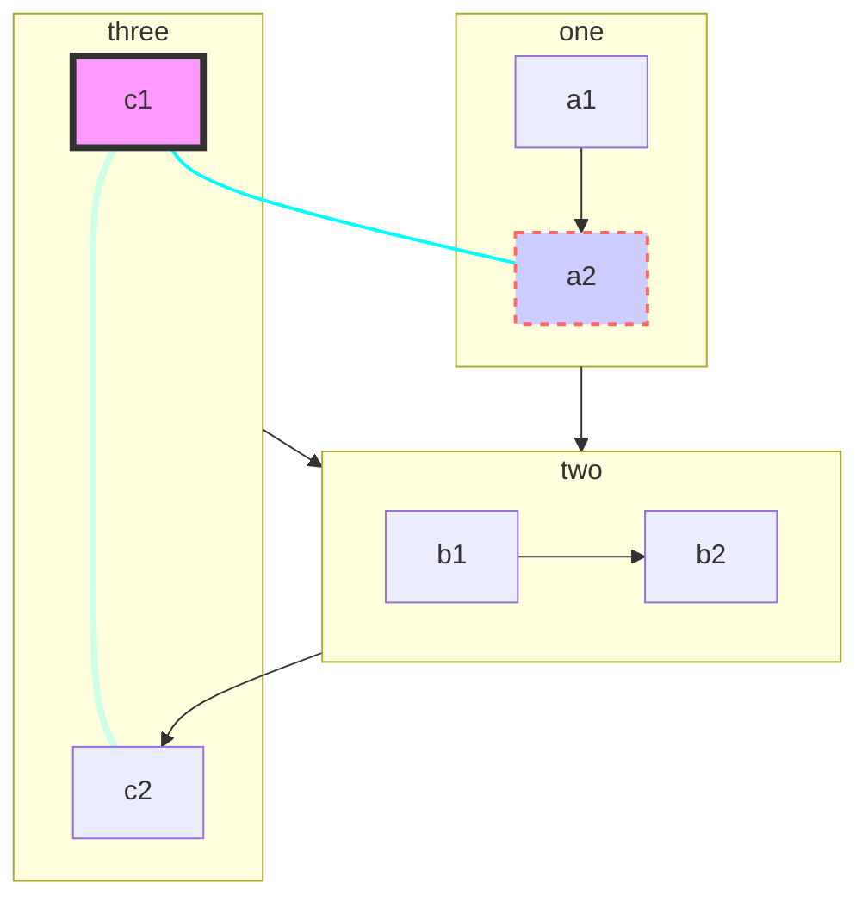
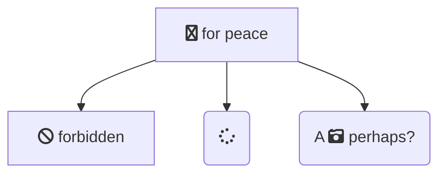
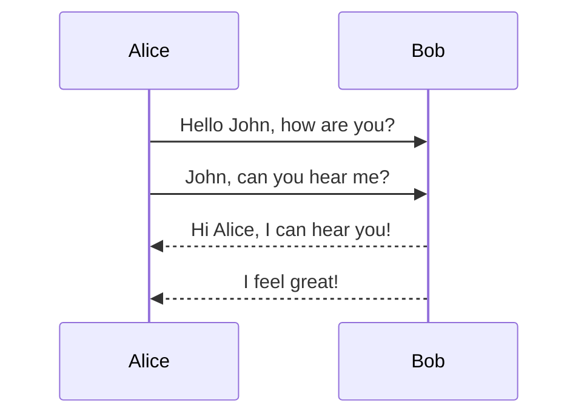
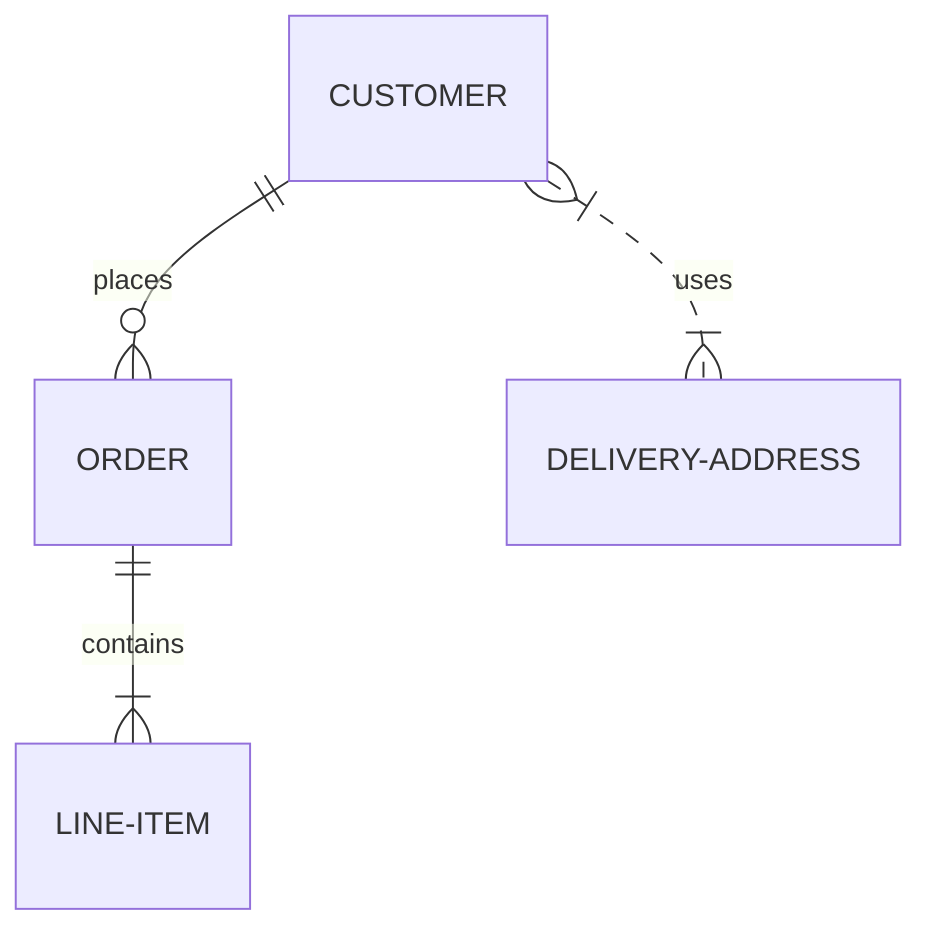
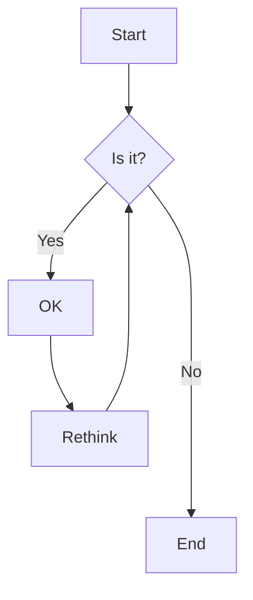
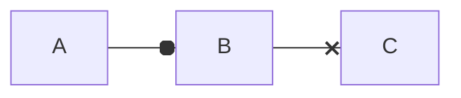
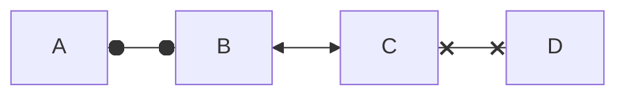

# 学习笔记-合集 {ignore=true}

李小飞

电子科技大学 光电学院

2021-11-25

----


<!-- @import "[TOC]" {cmd="toc" depthFrom=2 depthTo=3 orderedList=false} -->

<!-- code_chunk_output -->

- [1. Git and github](#1-git-and-github)
  - [1.1. Git 操作本地库（Repository](#11-git-操作本地库repository)
  - [1.2. Github 远程操作](#12-github-远程操作)
- [2. Markdown](#2-markdown)
  - [2.1. Markdown 基本语法](#21-markdown-基本语法)
  - [2.2. Markdown 扩展语法](#22-markdown-扩展语法)
  - [2.3. Markdown 公式输入 (katex)](#23-markdown-公式输入-katex)
  - [2.4 Mermaid 语法](#24-mermaid-语法)
  - [2.5 Reveal.js+markdown+vscode 制作PPT](#25-revealjsmarkdownvscode-制作ppt)
  - [2.6 MPE+reveal.js  做PPT](#26-mperevealjs-做ppt)

<!-- /code_chunk_output -->


## 1. Git and github

- Git是一款免费、开源的分布式版本控制系统，用于敏捷高效地处理任何或小或大的项目. 是 Linus Torvalds 为了帮助管理 Linux 内核开发而开发的一个开放源码的版本控制软件。工作原理分为工作区->add->缓存区->commit->本地库(repository)
- Github是一个代码托管云平台和开发者社区，开发者可以在Github上创建自己的开源项目并与其他开发者协作编码。创业公司可以用它来托管软件项目。

### 1.1. Git 操作本地库（Repository

#### 建立本地库

mkdir learning	
cd Learning	
git init	
ls -a, one can find a file .git	

#### 设置本地库签名

git config --global user.name xfli376	
git config --global user.email xfli376@qq.com	

#### 建立文件并添加到缓存区


vim test.md	
git status	
建立的文件在工作区，可以添加到缓存区 (add)	
git add test.md	
git status	
git rm    % 从缓存区删除	

#### 把缓存区文件提交到本地库 （Commit）

git commit -m "My First Commit" test.md	
git status	
git log	
git reflog	
vim test.md      %进行文件修改		
git diff test.md	
git add test.md  %修改后的文件（第二版）添加到缓存区	
git commit -m "My second Commit" test.md %提交第二版到本地库	
...	
git commit -m "My 3rd Commit" test.md " %提交第三版到本地库	
git add .	
git reflog	

#### 提取第X版本文件到工作区

git reflog	
回到上一个版本		
git rest --hard HEAD^ or HEAD-1		
回到上上个版本		
git rest --hard HEAD^^ or HEAD-2		
回到前第100个版本		
git rest --hard HEAD~100		
回到指定版本号的版本		
git rest --hard 版本号X		

#### 并行推进（分支技术）

git branch limen	
git branch wangwu	
git branch -v	
git checkout limen	
git branch -v	
vim test.md  # limen  修改了文件	
git add test.md		
git checkout master %回到master 分支		
git merge limen %把limen 分支的修改内容合并进来		
git add test.md		
git commit -m "Master merge limen First commit" test.md		
git branch -m main master		
git fetch origin		
git branch -u origin/master master		
git remote set-head origin -a		

### 1.2. Github 远程操作

#### 在github建立远程库

new respository-> Learning		
Create respository		

#### 查远程库地址并推送

https 别名 http://github.com/xfli376/Learning.git		
SSH   别名 git@github.com:xfli376/Learning.git		
Github CLI 别名 gh repo clone xfli376/Learning		
git remote add origin git@github.com:xfli376/Learning.git		
git push origin master		

#### Clone远程库到本地

mkdir ~/adirection		
cd ~/adirection		
git clone http://github.com/xfli376/Learning.git		

##### 用ssh进行Clonecd

ssh -T git@github.com		
git clone git@github.com:xfli376/Learning.git		
git fetch origin master		 

#### 开放给合作者

Settings-> Collaborators-> Add collaborator		
合作者lili  Accept invitation		
git push origin lili 			 

## 2. Markdown

Markdown是一种轻量级标记语言，创始人为约翰·格鲁伯（英语：John Gruber）。 它允许人们使用易读易写的纯文本格式编写文档。John Gruber在2004年创造了Markdown语言，现在有了MultiMarkdown、GitHub Flavored Markdown (GFM)、Pandoc、CommonMark等Markdown的变体。   
**注意**：Markdown 文档中可以直接使用HTML元素！

### 2.1. Markdown 基本语法

These are the elements outlined in John Gruber’s original design document. All Markdown applications support these elements.

#### Heading

```
	# H1
	## H2
	### H3
	#### H4
	##### H5
	###### H6
```

#### Paragraph

前后空行，表示是一段

#### Line

文字后空四格（Tab），表示硬换行。

#### Bold

这样`**bold text**` ， `__blod text__`，表示， 可得到 **bold text**，  __blod text__

#### Italic

这样表示 `*italicized text*`，  `_italicized text__`  就是 *italicized text*， _italicized text__ 
 
#### Blockquote (Tab)

```
> blockquote
> 
> > necked blockquote
> > necked blockquote
```
得到：  
> blockquote
> 
> > necked blockquote
> > necked blockquote

#### Ordered List

1. First item
2. Second item
3. Third item
   1. subitem 
   2. subitem

#### Unordered List

- First item
- Second item
- Third item
  1. subitem
  2. subitem
- New item
   
#### Code

in line `code`

#### Horizontal Rule

```
----
****
```
-----
*****

#### Link

这是文字连接 `[Markdown Guide](https://www.markdownguide.org)`
[Markdown Guide](https://www.markdownguide.org)

#### Image Link

这是插入图片 ``


设置图片大小


### 2.2. Markdown 扩展语法

These elements extend the basic syntax by adding additional features. Not all Markdown applications support these elements.

#### Table

| Syntax    | Description |
|    --- |    --- |
| Header    | Title       |
| Paragraph | Text        |
| 	    | Text        |

设置表格的对齐方式：

---: 设置内容和标题栏居右对齐。 
:--- 设置内容和标题栏居左对齐。 
:---: 设置内容和标题栏居中对齐。 

| Syntax    | Description |
|    :--- |    :---: |
| Header    | Title       |
| Paragraph | Text        |
| 	    | Text        |


#### Fenced Code Block

```
{
  "firstName": "John",
  "lastName": "Smith",
  "age": 25
}
```

#### Footnote

Here's a sentence with a footnote. [^1]

[^1]: This is the footnote.
 
#### Heading ID

```
#### My Great Heading {#custom-id}
```

#### Definition List

**牛顿第二定律**
: 物体受力与其运动的关系为 
$$
\vec{F}=m\vec{a}
$$
 
#### Strikethrough

~~The world is flat.~~ But we know it is not true   
<u>带下划线文本</u>
 
#### Task List

- [x] Write the press release
- [ ] Update the website
- [ ] Contact the media

#### Mermaid diagramm blocks


#### Escape character

Markdown 定义了很多特殊符号，如果要使用这些字符的本义，可以在前面加 “\”   
\### Escape character

### 2.3. Markdown 公式输入 (katex)

#### 行内公式与行间公式

行内 $a^2+b^2=c^2$ 公式

行间公式
$$
a^2+b^2=c^2
$$
 
#### \{ \} \text{} 和 \operatorname{}

${xyz}^{xyz}$, ${xyz}^xyz$,  $\operatorname{sin}(\theta)$ , $\sin(\theta)$,

$$
f(n)=n^n \quad \text{n$\in N^\ast$}
$$

#### 字符变大变小

$ \tiny x $, $\scriptsize x $, $\footnotesize x $, $\small x$, $\normalsize x$, $x$, $\large x$, $\Large x$, $\LARGE x$, $\huge x$, $\Huge x$, $\boldsymbol{\alpha 12bcEF}12bcEF$

#### 各种字体型

$\mathnormal  {abc123}$, $\mathrm  {abc123}$, $\mathit  {abc123}$, $\mathsf {abc123}$,$\mathtt  {abc123}$, $\mathfrak {  abc123}$, $\mathbb {  abc123}$, $\mathcal {abc123}$,$\mathscr {abc123}$, $\bold {abc123}$, $\bm {abc123}$

$\textcolor{red}{F=ma}$

$ \colorbox{red}{black on red} $

#### 空行与空格

用$\; or ~ or \, or \quad or \qquad or \space or \thinspace or \thickspace or \medspace or \: or \nobreakspace or \negthinspace or \negthickspace or \negmedspace$ 来产生空格

用$ \\  A  \newline A \\ $  进行换行

#### 括号

$\lang \phi\vert\psi \rang, \lfloor {abc} \rfloor, \lbrace {abc} \rbrace, \langle {ab} \rangle, \left( {abc} \right), \left[ {abc} \right], \lgroup {abc} \rgroup, \lang {abc} \rang, \lt {abc} \gt, \{ {abc} \},| \frac{a}{b} |, \|\frac{a}{b} \|,| \dfrac{a}{b} |, \|\dfrac{a}{b} \|$

$\tbinom{n}{k}$,$\binom{n}{k}$,$\dbinom{n}{k}$,${n\brace k}$,${n\choose k}$,${n\brack k}$

$$
\Bigg \{
    \bigg \{
        \Big \{
            \big \{
                    \dfrac{a}{b}
            \big \}
        \Big \}
    \bigg \}
\Bigg \}
$$

$$
a = \left(1 + 2 + 3 + \cdots\right. \\ \qquad \left. n - 2 + n - 1 + n\right.)
$$

$$
\left. f(x)\middle |_{x=0} \right.
$$

#### 上下关系

${1}\over{xyz\over{x}}$， $x \atop y$，$\stackrel{x}{y}$, $\overset{x}{y}$, $\underset{x}{y}$, $a\raisebox{0.25em}{b}c$,

$ \displaystyle \sum_{i=1}^N $

#### 分数

$\tfrac{s}{m},\frac{s}{m},\dfrac{s}{m},\cfrac{s}{m} $

#### 点和头

$ 
\ldots, \dots, \cdots, \vdots, \ddots 
$

$ 
a^{\prime}, \bar{a}, \breve{a}, \dot{a}, \ddot{a}, \hat{a}, \widehat{ace}, \mathring{A},  \vec{F}=m\vec{a}
$ 

#### 数学推导

$\rArr$，$\rarr$，$\lrArr$，$\lrarr$，$\nRightarrow$，$\nLeftarrow$，$\nLeftrightarrow$，$\implies$， $\xRightarrow[under]{over}$，$\xrightarrow[under]{over}, \to, \propto, \approx $

$\because, \therefore, \forall, \And, \exists$

#### 求和，积分和极限

$$
\sum_{1 < i < N} {\frac {N-i+1}{i^{N-1}} }
$$

$$
\sum\limits_{i=1}^{N}{\frac {N-i+1}{i^{N-1}} }
$$

$\displaystyle \int_{0}^{\infty} f(x) dx $,

$\int_{0} ^{\infty} f(x) dx $,
$\displaystyle \int\limits_{0}^{\infty} f(x) dx $,

$\int\limits_{0}^{\infty} f(x) dx $,
$\smallint$, $\intop$, $\iint$, $\iiint$, $\oint$, $\oiint$, $\oiiint$

$\lim\limits_{i \to \infty} \dfrac{1}{i} = 0 $

#### 符号

$\times, \div, \mp, \pm, \oplus, \otimes, \equiv, \ne, \sim,\le, \ge, \gg, \ll, \geqq, \leqq, \pmod{a}, \mod{a},\centerdot, \bullet, \in, \ni, \cong, \gt, $
$\text{\sect}, \copyright, \bigtriangledown, \hbar, \ell, \yen, \degree, \angle, \infty, \ast,\star, \bigstar, \%$

$\alpha, \beta, \gamma, \delta, \epsilon, \zeta, \eta, \theta, \lambda, \mu, \nu,  \xi,  \pi, \rho, \sigma,  \tau, \upsilon, $

$\phi, \chi, \psi, \omega, \varphi, \varsigma, \varepsilon,  \nabla, \partial $

##### Define

$ \def\foo{x^2} \foo + \foo $

$ \gdef\bar#1{#1^2} \bar{x} + \bar{y}$

##### Direct Input:

§ ¶ £ ¥ ∇ ∞ · ∠ ∡ ∢ ♠ ♡ ♢ ♣ ♭ ♮ ♯ ✓ … ⋮ ⋯ ⋱ ! £ ¥ ∇ ∞ ⋅ ∠ ∡ ∢ ♠ ♡ ♢ ♣ ♭ ♮ ♯ ✓ … ⋮ ⋯⋱ ! ‼ ⦵
 
#### 矩阵

$$
\begin{matrix} 
1 & 2 & 3 \\   
2 & 3 & 4 \\   
4 & 5 & 6 \\  
\end{matrix}
$$

$$
\begin{pmatrix}  
1 & 2 & 3 \\   
2 & 3 & 4 \\  
4 & 5 & 6 \\  
\end{pmatrix}
$$

$$
\begin{bmatrix} 
1 & 2 & 3 \\ 
2 & 3 & 4 \\ 
4 & 5 & 6 \\ 
\end{bmatrix}
$$

$$
\begin{vmatrix} 
1 & 2 & 3 \\ 
2 & 3 & 4 \\ 
4 & 5 & 6 \\ 
\end{vmatrix}
$$

$$
\begin{Vmatrix} 
1 & 2 & 3 \\   
2 & 3 & 4 \\   
4 & 5 & 6 \\   
\end{Vmatrix}
$$

#### 数组、数表、方程组

$$
\begin{array}{lcr} 
1 & 2 & 3 \\ 
2 & 3 & 4 \\ 
4 & 5 & 6 \\ 
\end{array}
$$

$$
\begin{array}{l|crlc:r} 
1 & 2 & 3 & 1 & 2 & 3 \\ \hline
2 & 3 & 4 & 2 & 3 & 4 \\ 
4 & 5 & 6 & 4 & 5 & 6 \\ \hline \hline
4 & 5 & 6 & 4 & 5 & 6 \\ 
\end{array}
$$

$$
\left \{
\begin{array}{l} 
a_1x+b_1y+c_1=0  \\ 
a_2x+b_2y+c_2=0  \\ 
a_3x+b_3y+c_3=0   
\end{array}
\right.
$$

#### 条件式

$$
\delta (x)=
\begin{cases} 
1, &  \text{if} x = 0  \\  
0, &  \text{if} x \neq 0   
\end{cases}
$$

#### 一般公式、多行公式对齐及公式编号

$$
\begin{equation}
x^2+y^2=1
\end{equation}
$$

$$
x^2+y^2=1 \tag{1}
$$

$$
\begin{aligned}
 a &= a+c \\
   &= a+b+d 
\end{aligned}
$$

$$
\left \{
\begin{alignedat}{3}
 10 &x +3 &&y =20 \\
  8 &x +13 &&y = 8 
\end{alignedat}
\right.
$$


### 2.4 Mermaid 语法

Mermaid lets you create diagrams and visualizations using text and code.

It is a Javascript based diagramming and charting tool that renders Markdown-inspired text definitions to create and modify diagrams dynamically.

**项目**： https://github.com/mermaid-js/mermaid 

实例： 流程图做朱元璋家谱（圆圈代表皇帝）



```mermaid
graph TB %% comments
  %% Entity[Text]
  ID-1[Node 1]
  ID-2>Node 2]
  ID-3(Node 3 <br> text)
  
  %% Entity--Entity
  ID-1---ID-2
  ID-1 --> ID-3

  %% Entity--Text--Entity
  ID-2--23---ID-3
  ID-3--31-->ID-1
  ID-3 -- "Action from 3 to 2"--> ID-2

  %% Complex cases
  A[Hard edge] -->|Link text| B(Round edge)
  B --> C{Text}
  C -->|One| D[Text]
  A(A) --> B(B)
  C[/C/] --> D>D]

  %% class/classDef
  classDef blue fill:#08f,stroke:#fff;
  class ID-1 blue
  class ID-1,ID-2 red

  %% click
  click ID-1 "https://github.com" "Tooltip text" %% comments
  click ID-2 alert "Tooltip for a callback"
  %% subgraph
  subgraph A subgraph
    ID-4{Node 4}
    ID-5((fa:fa-spinner))
    ID-6["Node 6 (same #quot;shape#quot;)"]
    ID-4-.->ID-5
    ID-5 -. Action from 5 to 4 .-> ID-4
    ID-5==>ID-6
    ID-6 == Action from 6 to 5 ==> ID-5
  end
```



#### 图的类型

- 饼状图：pie   
- 流程图：graph   
- 时序图：sequenceDiagram 
- 甘特图：gantt 
- 类图：  classDiagram 
- 状态图：stateDiagram
- 旅程图：journey
- 实体-联系图: erDiagram


#### 方向：声明流程图的方向。

- graph或graph TB或graph TD：从上往下
- graph BT：从下往上
- graph LR：从左往右
- graph RL：从右往左

#### 结点(graph)

- 结点名-ID，
- 结束内容，括号里的内容
- 结点形态，由括号形态决定
  - 默认方形
  - id1[方形]
  - id2(圆边矩形)
  - id3([体育场形])
  - `id4[[子程序形]]`
  - id5[(圆柱形)]
  - id6((圆形))
  - id7<左角右方形]
  - id8{菱形}
  - id9{{六角形}}
  - id10[/平行四边形/]
  - id11[\反向平行四边形\]
  - id12[/梯形\]
  - id13[\反向梯形/]
  - id14[(Database)]
  
#### 连线(graph)

- 实线箭头
    - a-->b
    - a--ab-->b
    - a-->|ab| b
- 粗实线箭头
    - a==>b
    - a\==ab==>b
    - a==>|ab| b
- 虚线箭头
    - a-.->b
    - a-.ab.->b
- 无箭头连线
    - a--b
    - a-.-b
    - a== b
- 样式
  linkStyle 0 stroke:#0ff,stroke-width:2px;
  linkStyle 3 stroke:#ff3,stroke-width:4px;
  style id1 fill:#f9f,stroke:#333,stroke-width:4px
  style id2 fill:#ccf,stroke:#f66,stroke-width:2px,stroke-dasharray: 5, 5

#### 子图



#### 图标

使用 Font Awesome 图标, 语法: fa:icon class-name



其他实例: 1.时序图：











<body>
  <div class="mermaid">
    flowchart LR;
        A-->B;
        B-->C;
        C-->D;
        click A callback "Tooltip"
        click B "http://www.github.com" "This is a link"
        click C call callback() "Tooltip"
        click D href "http://www.github.com" "This is a link"
  </div>

  <script>
    var callback = function(){
        alert('A callback was triggered');
    }
    var config = {
        startOnLoad:true,
        flowchart:{
            useMaxWidth:true,
            htmlLabels:true,
            curve:'cardinal',
        },
        securityLevel:'loose',
    };

    mermaid.initialize(config);
  </script>
</body>
 
---
  
### 2.5 Reveal.js+markdown+vscode 制作PPT

---

#### 前言

reveal-md 是使用 Markdown 和 HTML 写逼格满满的 PPT 的开源项目

项目地址：[reveal-md]{https://github.com/webpro/reveal-md}

---

#### 特点

Reveal.js 可以使用 markdown 语言直接写静态的文本，并可以加入各种 html 语言支持的交互动画,
reveal.js 是一个开放源代码 HTML 表示框架。它使使用 Web 浏览器的任何人都可以免费创建功能齐全且美观的演示文稿
该框架具有广泛的功能，包括嵌套幻灯片，Markdown 支持，自动动画，PDF 导出，演讲者注释，LaTeX 支持，语法突出显示的代码等等

项目地址：[reveal.js]{https://github.com/hakimel/reveal.js/archive/master.zip}

---

#### Reveal 安装

* npm install -g reveal-md
* git clone https://github.com/hakimel/reveal.js.gif
* cd reveal.js && npm install
* npm start &

---

#### 环境

- vscode-reveal 
- Markdown All in One 
- Markdown Preview Enhanced 
- view-in-browser 

---

####  Markup

Here's a barebones example of a fully working reveal.js presentation:

```html
<html>
  <head>
    <link rel="stylesheet" href="dist/reveal.css">
    <link rel="stylesheet" href="dist/theme/white.css">
  </head>
  <body>
    <div class="reveal">
      <div class="slides">
        <section>Slide 1</section>
        <section>Slide 2</section>
      </div>
    </div>
    <script src="dist/reveal.js"></script>
    <script>
      Reveal.initialize();
    </script>
  </body>
</html>
```

---

#### Markdown 
```
<section data-markdown>
  <textarea data-template>
    ## Slide 1
    A paragraph with some text and a [link](http://hakim.se).
    ---
    ## Slide 2
    ---
    ## Slide 3
  </textarea>
</section>
```

---

#### Markdown Plugin

```
<script src="plugin/markdown/markdown.js"></script>
<script>
  Reveal.initialize({
    plugins: [ RevealMarkdown ]
  });
</script>
```

---

#### External Markdown

This feature requires that reveal.js runs from a local web server.
```
<section data-markdown="example.md"
         data-separator="^\n\n\n"
         data-separator-vertical="^\n\n"
         data-separator-notes="^Note:"
         data-charset="iso-8859-15">
    <!--
        Note that Windows uses `\r\n` instead of `\n` as its linefeed character.
        For a regex that supports all operating systems, use `\r?\n` instead of `\n`.
    -->
</section>
```

---

#### Themes 

- black:	Black background, white text, blue links (default)
- white:	White background, black text, blue links
- league:	Gray background, white text, blue links
- beige:	Beige background, dark text, brown links
- sky:	Blue background, thin dark text, blue links
- night:	Black background, thick white text, orange links
- serif:	Cappuccino background, gray text, brown links

--

- simple:	White background, black text, blue links
- solarized:	Cream-colored background, dark green text, blue links
- blood:	Dark background, thick white text, red links
- moon:	Dark blue background, thick grey text, blue links

--

#### Themes 选择

1. 在md文件最前面加上一句 theme : "black"
2. 在导出的index.hrml 中改 
```html
<link rel="stylesheet" href="dist/theme/black.css">
```
3. you can opt to start from a blank CSS document and customize everything from the ground up

---

#### Transitions 

- none:	Switch backgrounds instantly
- fade:	Cross fade — default for background transitions
- slide:	Slide between backgrounds — default for slide transitions
- convex:	Slide at a convex angle
- concave:	Slide at a concave angle
- zoom:	 Scale the incoming slide up so it grows in from the center of the screen

---

#### Transitions 选择

```html
<section data-transition="slide">
    The train goes on …
</section>
<section data-transition="slide">
    and on …
</section>
<section data-transition="slide-in fade-out">
    and stops.
</section>
<section data-transition="fade-in slide-out">
    (Passengers entering and leaving)
</section>
<section data-transition="slide">
    And it starts again.
</section>
```
```
Reveal.initialize({
  backgroundTransition: 'slide'
});
```

---

#### Configuration Options
```
Reveal.initialize({

  // Display presentation control arrows
  controls: true,

  // Help the user learn the controls by providing hints, for 
  // bouncing the down arrow when they first encounter a ...
  controlsTutorial: true,

  // Determines where controls appear, "edges" or ...
  controlsLayout: 'bottom-right',
  ...
  });

```
```
// Turn autoSlide off
Reveal.configure({ autoSlide: 0 });

// Start auto-sliding every 5s
Reveal.configure({ autoSlide: 5000 });
```

---

#### Presentation Size
```
Reveal.initialize({
  // The "normal" size of the presentation, aspect ratio will
  // be preserved when the presentation is scaled to fit different
  // resolutions. Can be specified using percentage units.
  width: 960,
  height: 700,

  // Factor of the display size that should remain empty around
  // the content
  margin: 0.04,

  // Bounds for smallest/largest possible scale to apply to content
  minScale: 0.2,
  maxScale: 2.0
});
```

---

#### Center

Slides are vertically centered on the screen based on how much content they contain. To disable this and leave slides fixed at their configured height set center to false.
```
Reveal.initialize({ center: false })

```

---

#### Embedded

By default, reveal.js will assume that it should cover the full browser viewport. If you want to embed your presentation within a smaller portion of a web page, or show multiple presentations on the same page, you can use the embedded config option.
```
Reveal.initialize({ embedded: false })
```

---

#### Color Backgrounds
```
<section data-background-color="aquamarine">
  <h2>🐟</h2>
</section>
<section data-background-color="rgb(70, 70, 255)">
  <h2>🐳</h2>
</section>
```

---

#### Image Backgrounds
```
<section data-background-image="http://example.com/image.png">
  <h2>Image</h2>
</section>
<section data-background-image="http://example.com/image.png" 
          data-background-size="100px" data-background-repeat="repeat">
  <h2>This background image will be sized to 100px and repeated</h2>
</section>
```

---

#### Media

#### Autoplay
```
<video data-autoplay src="http://clips.vorwaerts-gmbh.de/big_buck_bunny.mp4"></video>
```
```
Reveal.initialize({
	autoPlayMedia: true
})
```

---

### 2.6 MPE+reveal.js  做PPT

Markdown Preview Enhanced（MPE） is a SUPER POWERFUL markdown extension for Atom and Visual Studio Code. The goal of this project is to bring you a wonderful markdown writing experience.

#### Features

- Automatic scroll sync
- Import external files
- Code Chunk
- Pandoc
- Prince
- eBook
- Presentation Writer
- Extensible
- LaTeX math
- Export PDF, PNG, and JPEG by Puppeteer
- Export beautiful HTML (mobile device supported)
- Compile to GitHub Flavored Markdown
- Customize Preview CSS
- TOC generation
- Flowchart / Sequence diagram and many other kinds of graphs
- Embed LaTeX, render TikZ, Chemfig etc
- Task List (Github Flavored)
- Image Helper
- Footnotes
- Front Matter
- And many more...


 #### presentation

 Markdown Preview Enhanced uses reveal.js to render beautiful presentations.

##### presentation themes  
- "beige.css"
- "black.css"
- "blood.css"
- "league.css"
- "moon.css"
- "night.css"
- "serif.css"
- "simple.css"
- "sky.css"
- "solarized.css"
- "white.css"
- "none.css"

##### Presentation Front-Matter

You can configure your presentation by adding front-matter to your markdown file.

```
---
presentation:
  width: 800
  height: 600
  theme: white.css
  slideNumber: false
  center: true
  fragments: true
  transition: # none/fade/slide/convex/concave/zoom
  backgroundTransition: 'default' # none/fade/slide/convex/concave/zoom 
---
```

##### New slide 
```
<!-- slide -->

Your slides goes here...

<!-- slide id="my-id" class="my-class1 my-class2" -->

Your slides goes here...
```

##### New in-line-number

```javascript {.line-numbers}
function add(x, y) {
  return x + y;
}
```

```javascript {highlight=10}
```

```javascript {highlight=10-20}
```

```javascript {highlight=[1-10,15,20-22]}
```

##### ExtendedTable

Need to enable enableExtendedTableSyntax in extension settings to get it work.

| Syntax    | Description |
|    :--- |    :---: |
| Header    | Title       |
| Paragraph | Text        |
| 	 ^   | Text        |


##### Emoji & Font-Awesome

:smile:
:fa-car:
30^th^
H~2~O
*[HTML]: Hyper Text Markup Language
*[W3C]: World Wide Web Consortium
The HTML specification
is maintained by the W3C.
==marked==
!!! note This is the admonition title
This is the admonition body

```math
x^2+y^2=1
```

mermaid {code_block=true}

puml {align="center"}

mermaid {filename="my_mermaid.png"}

##### TOC {ignore=true}
Markdown Preview Enhanced can create TOC for your markdown file. You can press cmd-shift-p then choose Markdown Preview Enhanced: Create Toc to create TOC. Multiple TOCs can be created. To exclude a heading from the TOC, append {ignore=true} after your heading.


