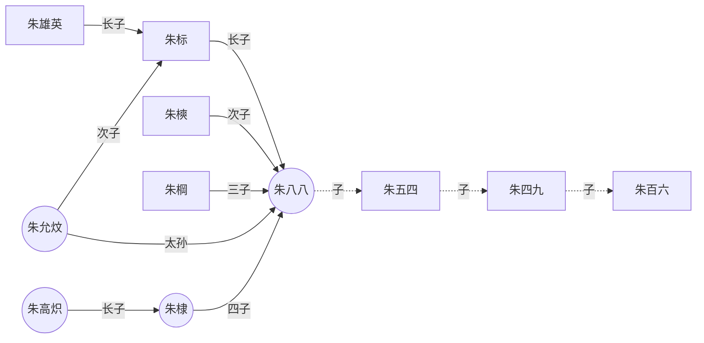
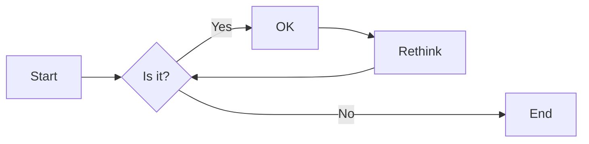
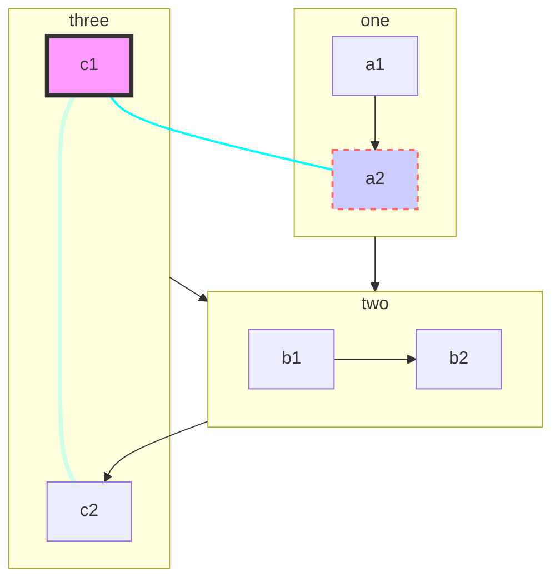
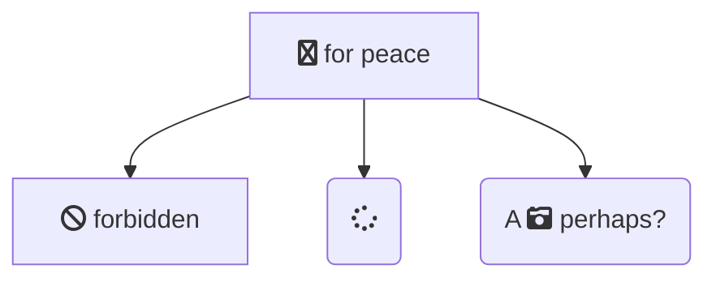
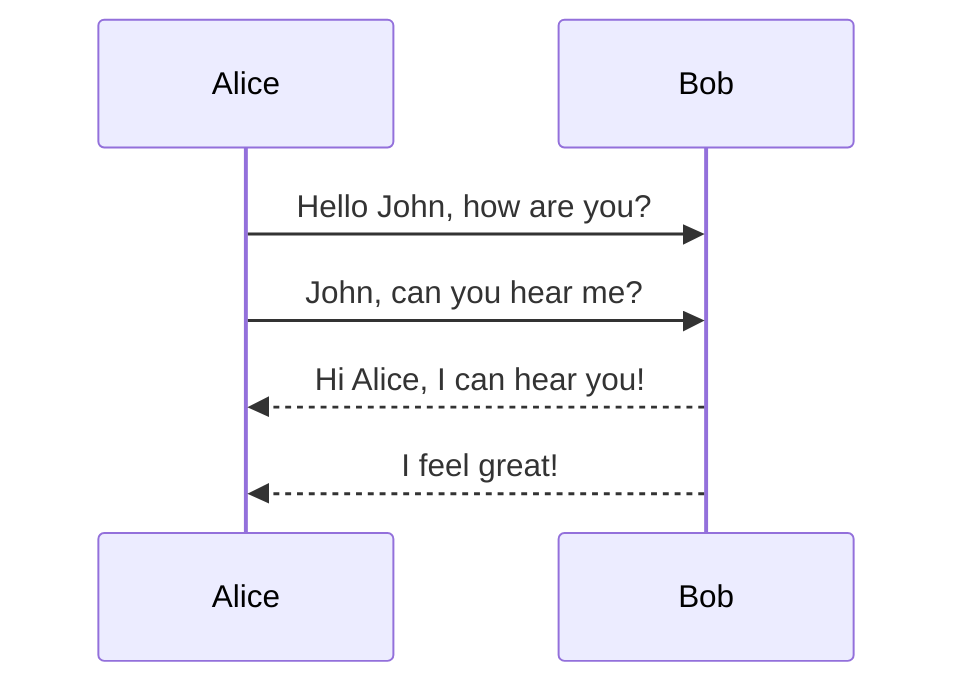
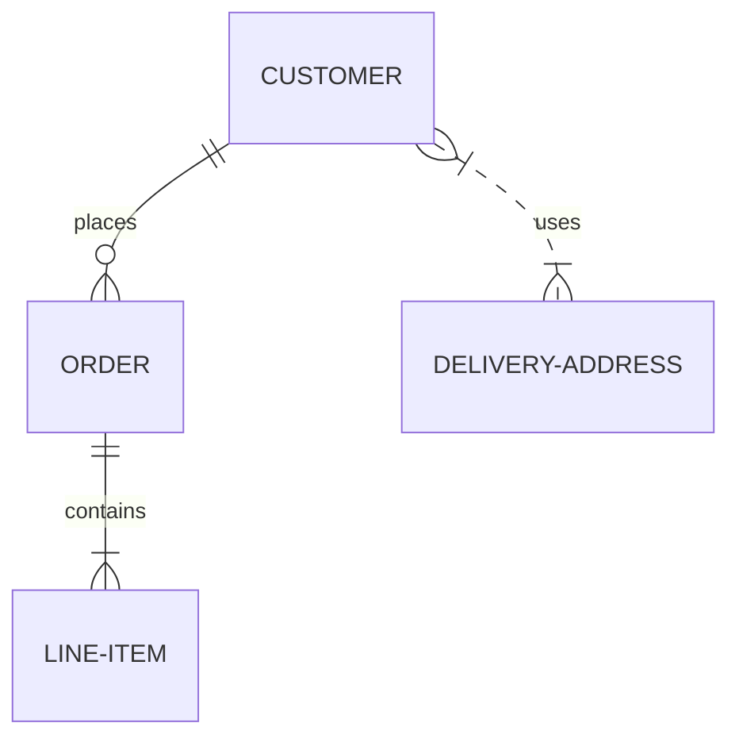
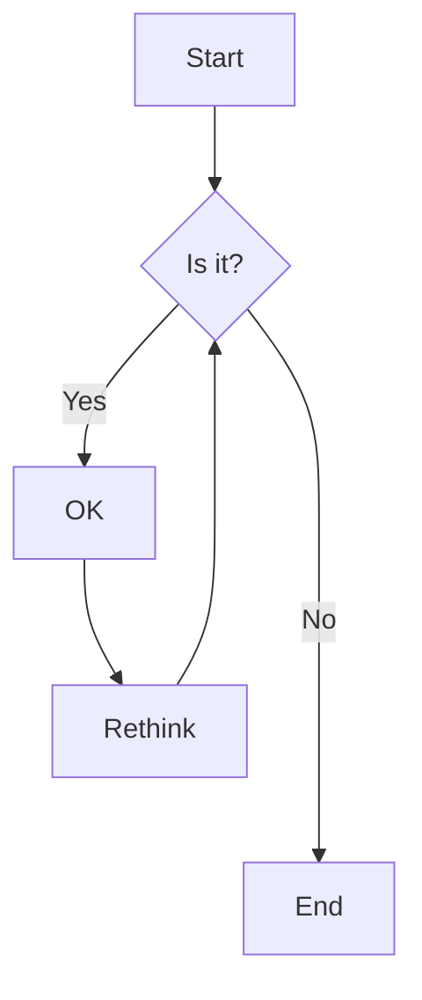
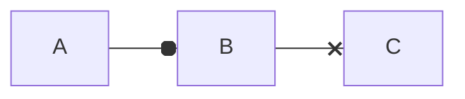
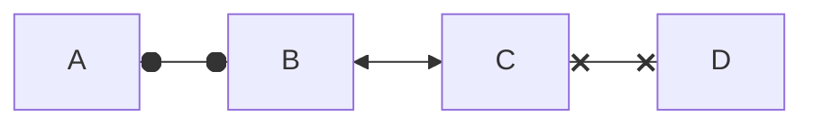

# 学习笔记-合集 {ignore=true}

李小飞

电子科技大学 光电学院

2021-11-25

----


<!-- @import "[TOC]" {cmd="toc" depthFrom=2 depthTo=2 orderedList=false} -->

<!-- code_chunk_output -->

- [1. VScode](#1-vscode)
- [2. 版本管理工具 Git and github](#2-版本管理工具-git-and-github)
- [3. Markdown](#3-markdown)
- [4. 数学公式输入 (katex)](#4-数学公式输入-katex)
- [5. Mermaid 语法](#5-mermaid-语法)
- [6. Reveal.js+markdown+vscode 制作PPT](#6-revealjsmarkdownvscode-制作ppt)
- [7. MPE+reveal.js  做PPT](#7-mperevealjs-做ppt)
- [8. VSCode+Latex](#8-vscodelatex)

<!-- /code_chunk_output -->

## 1. VScode 
VS Code是个简化高效的代码编辑器，同时支持如调试、任务执行，版本管理等开发操作。它的目标就是提供一个快速的编码-编译-调试的工具。然后其它的都交给IDE。

### 快捷键
cmd+k and ctrl+s  打开快捷键一览表。在这里面、你可以查看、搜索、修改快捷键。

#### 选择复制粘贴撤销(VIM)
选定： 
    esc v： 进入行可视模式 +移动光标进行选择

列操作：esc ctrl+v： 进入列可视模式 +移动上/下光标进行列选择, shift+I（A) 插入  

复制： yank（提起） (cmd+c)
   y： 复制选定块到缓冲区；
   yy：    复制整行（nyy或者yny ，复制n行，n为数字）；
   y^：   复制当前到行头的内容；
   y$：    复制当前到行尾的内容；
   yw：   复制一个word （nyw或者ynw，复制n个word，n为数字）；
   yG：    复制至档尾（nyG或者ynG，复制到第n行，例如1yG或者y1G，复制到档尾） 

剪切：delete，(cmd+x)
    d：     剪切选定块到缓冲区；
    dd：    剪切整行
    d^：    剪切至行首
    d$：     剪切至行尾
    dw：    剪切一个word
    dG：     剪切至档尾 

粘贴：put（放下）(cmd+v)
    p：    贴至游标后
    P：    贴至游标前

撤销：u (undo) (cmd+z)
重恢：Ctrl+R

### 常用插件与环境设置
cmd+p, > Open Settings,打开设置(json)


## 2. 版本管理工具 Git and github

- Git是一款免费、开源的分布式版本控制系统，用于敏捷高效地处理任何或小或大的项目. 是 Linus Torvalds 为了帮助管理 Linux 内核开发而开发的一个开放源码的版本控制软件。工作原理分为工作区->add->缓存区->commit->本地库(repository)
- Github是一个代码托管云平台和开发者社区，开发者可以在Github上创建自己的开源项目并与其他开发者协作编码。创业公司可以用它来托管软件项目。

### Git 操作本地库（Repository

#### 建立本地库

mkdir learning	
cd Learning	
git init	
ls -a, one can find a file .git	

#### 设置本地库签名

git config --global user.name xfli376	
git config --global user.email xfli376@qq.com	

#### 建立文件并添加到缓存区


vim test.md	
git status	
建立的文件在工作区，可以添加到缓存区 (add)	
git add test.md	
git status	
git rm    % 从缓存区删除	

#### 把缓存区文件提交到本地库 （Commit）

git commit -m "My First Commit" test.md	
git status	
git log	
git reflog	
vim test.md      %进行文件修改		
git diff test.md	
git add test.md  %修改后的文件（第二版）添加到缓存区	
git commit -m "My second Commit" test.md %提交第二版到本地库	
...	
git commit -m "My 3rd Commit" test.md " %提交第三版到本地库	
git add .	
git reflog	

#### 提取第X版本文件到工作区

git reflog	
回到上一个版本		
git rest --hard HEAD^ or HEAD-1		
回到上上个版本		
git rest --hard HEAD^^ or HEAD-2		
回到前第100个版本		
git rest --hard HEAD~100		
回到指定版本号的版本		
git rest --hard 版本号X		

#### 并行推进（分支技术）

git branch limen	
git branch wangwu	
git branch -v	
git checkout limen	
git branch -v	
vim test.md  # limen  修改了文件	
git add test.md		
git checkout master %回到master 分支		
git merge limen %把limen 分支的修改内容合并进来		
git add test.md		
git commit -m "Master merge limen First commit" test.md		
git branch -m main master		
git fetch origin		
git branch -u origin/master master		
git remote set-head origin -a		

### Github 远程操作

#### 在github建立远程库

new respository-> Learning		
Create respository		

#### 查远程库地址并推送

https 别名 http://github.com/xfli376/Learning.git		
SSH   别名 git@github.com:xfli376/Learning.git		
Github CLI 别名 gh repo clone xfli376/Learning		
git remote add origin git@github.com:xfli376/Learning.git		
git push origin master		

#### Clone远程库到本地

mkdir ~/adirection		
cd ~/adirection		
git clone http://github.com/xfli376/Learning.git		

##### 用ssh进行Clonecd

ssh -T git@github.com		
git clone git@github.com:xfli376/Learning.git		
git fetch origin master		 

#### 开放给合作者

Settings-> Collaborators-> Add collaborator		
合作者lili  Accept invitation		
git push origin lili 		

### 在VScode中的环境设置


## 3. Markdown

Markdown是一种轻量级标记语言，创始人为约翰·格鲁伯（英语：John Gruber）。 它允许人们使用易读易写的纯文本格式编写文档。John Gruber在2004年创造了Markdown语言，现在有了MultiMarkdown、GitHub Flavored Markdown (GFM)、Pandoc、CommonMark等Markdown的变体。   
**注意**：Markdown 文档中可以直接使用HTML元素！

### Markdown 基本语法

These are the elements outlined in John Gruber’s original design document. All Markdown applications support these elements.

#### 注释
> 表示块注释
> 
#### Heading

```
	# H1
	## H2
	### H3
	#### H4
	##### H5
	###### H6
```

#### Paragraph

前后空行，表示是一段

#### Line

文字后空四格（Tab），表示硬换行。

#### Bold

这样`**bold text**` ， `__blod text__`，表示， 可得到 **bold text**，  __blod text__

#### Italic

这样表示 `*italicized text*`，  `_italicized text__`  就是 *italicized text*， _italicized text__ 
 
#### Blockquote (Tab)

```
> blockquote
> 
> > necked blockquote
> > necked blockquote
```
得到：  
> blockquote
> 
> > necked blockquote
> > necked blockquote

#### Ordered List

1. First item
2. Second item
3. Third item
   1. subitem 
   2. subitem

#### Unordered List

- First item
- Second item
- Third item
  1. subitem
  2. subitem
- New item
   
#### Code

in line `code`

#### Horizontal Rule

```
----
****
```
-----
*****

#### Link

这是文字连接 `[Markdown Guide](https://www.markdownguide.org)`
[Markdown Guide](https://www.markdownguide.org)

#### Image Link

这是插入图片 ``


设置图片大小


### Markdown 扩展语法

These elements extend the basic syntax by adding additional features. Not all Markdown applications support these elements.

#### Table

| Syntax    | Description |
|    --- |    --- |
| Header    | Title       |
| Paragraph | Text        |
| 	    | Text        |

设置表格的对齐方式：

---: 设置内容和标题栏居右对齐。 
:--- 设置内容和标题栏居左对齐。 
:---: 设置内容和标题栏居中对齐。 

| Syntax    | Description |
|    :--- |    :---: |
| Header    | Title       |
| Paragraph | Text        |
| 	    | Text        |


#### Fenced Code Block

```
{
  "firstName": "John",
  "lastName": "Smith",
  "age": 25
}
```

#### Footnote

Here's a sentence with a footnote. [^1]

[^1]: This is the footnote.
 
#### Heading ID

```
#### My Great Heading {#custom-id}
```

#### Definition List

**牛顿第二定律**
: 物体受力与其运动的关系为 
$$
\vec{F}=m\vec{a}
$$
 
#### Strikethrough

~~The world is flat.~~ But we know it is not true   
<u>带下划线文本</u>
 
#### Task List

- [x] Write the press release
- [ ] Update the website
- [ ] Contact the media

#### Mermaid diagramm blocks


#### Escape character

Markdown 定义了很多特殊符号，如果要使用这些字符的本义，可以在前面加 “\”   
\### Escape character

## 4. 数学公式输入 (katex)

#### 行内公式与行间公式

行内 $a^2+b^2=c^2$ 公式

行间公式
$$
a^2+b^2=c^2
$$
 
#### \{ \} \text{} 和 \operatorname{}

${xyz}^{xyz}$, ${xyz}^xyz$,  $\operatorname{sin}(\theta)$ , $\sin(\theta)$,

$$
f(n)=n^n \quad \text{n$\in N^\ast$}
$$

#### 字符变大变小

$ \tiny x $, $\scriptsize x $, $\footnotesize x $, $\small x$, $\normalsize x$, $x$, $\large x$, $\Large x$, $\LARGE x$, $\huge x$, $\Huge x$, $\boldsymbol{\alpha 12bcEF}12bcEF$

#### 各种字体型

$\mathnormal  {abc123}$, $\mathrm  {abc123}$, $\mathit  {abc123}$, $\mathsf {abc123}$,$\mathtt  {abc123}$, $\mathfrak {  abc123}$, $\mathbb {  abc123}$, $\mathcal {abc123}$,$\mathscr {abc123}$, $\bold {abc123}$, $\bm {abc123}$

$\textcolor{red}{F=ma}$

$ \colorbox{red}{black on red} $

#### 空行与空格

用$\; or ~ or \, or \quad or \qquad or \space or \thinspace or \thickspace or \medspace or \: or \nobreakspace or \negthinspace or \negthickspace or \negmedspace$ 来产生空格

用$ \\  A  \newline A \\ $  进行换行

#### 括号

$\lang \phi\vert\psi \rang, \lfloor {abc} \rfloor, \lbrace {abc} \rbrace, \langle {ab} \rangle, \left( {abc} \right), \left[ {abc} \right], \lgroup {abc} \rgroup, \lang {abc} \rang, \lt {abc} \gt, \{ {abc} \},| \frac{a}{b} |, \|\frac{a}{b} \|,| \dfrac{a}{b} |, \|\dfrac{a}{b} \|$

$\tbinom{n}{k}$,$\binom{n}{k}$,$\dbinom{n}{k}$,${n\brace k}$,${n\choose k}$,${n\brack k}$

$$
\Bigg \{
    \bigg \{
        \Big \{
            \big \{
                    \dfrac{a}{b}
            \big \}
        \Big \}
    \bigg \}
\Bigg \}
$$

$$
a = \left(1 + 2 + 3 + \cdots\right. \\ \qquad \left. n - 2 + n - 1 + n\right.)
$$

$$
\left. f(x)\middle |_{x=0} \right.
$$

#### 上下关系

${1}\over{xyz\over{x}}$， $x \atop y$，$\stackrel{x}{y}$, $\overset{x}{y}$, $\underset{x}{y}$, $a\raisebox{0.25em}{b}c$,

$ \displaystyle \sum_{i=1}^N $

#### 分数

$\tfrac{s}{m},\frac{s}{m},\dfrac{s}{m},\cfrac{s}{m} $

#### 点和头

$ 
\ldots, \dots, \cdots, \vdots, \ddots 
$

$ 
a^{\prime}, \bar{a}, \breve{a}, \dot{a}, \ddot{a}, \hat{a}, \widehat{ace}, \mathring{A},  \vec{F}=m\vec{a}
$ 

#### 数学推导

$\rArr$，$\rarr$，$\lrArr$，$\lrarr$，$\nRightarrow$，$\nLeftarrow$，$\nLeftrightarrow$，$\implies$， $\xRightarrow[under]{over}$，$\xrightarrow[under]{over}, \to, \propto, \approx $
$\Leftrightarrow \nLeftrightarrow \Longleftrightarrow \iff$
$\Rrightarrow \Lleftarrow$
$\Rightarrow \nRightarrow \Longrightarrow \implies$
$\Leftarrow \nLeftarrow \Longleftarrow$
$\Uparrow \Downarrow \Updownarrow$
$\leftarrow \rightarrow \nleftarrow \nrightarrow \leftrightarrow $  $\nleftrightarrow \longleftarrow \longrightarrow \longleftrightarrow$
$\leftrightharpoons \rightleftharpoons$
$\curvearrowright \circlearrowright$
$\xleftarrow{left} \xrightarrow{right}$
$\dagger \ddagger$
$\uparrow \downarrow \updownarrow \nearrow \searrow \nwarrow \swarrow$


$\because, \therefore, \forall, \And, \exists$

#### 求和，积分和极限

$$
\sum_{1 < i < N} {\frac {N-i+1}{i^{N-1}} }
$$

$$
\sum\limits_{i=1}^{N}{\frac {N-i+1}{i^{N-1}} }
$$

$\displaystyle \int_{0}^{\infty} f(x) dx $,

$\int_{0} ^{\infty} f(x) dx $,
$\displaystyle \int\limits_{0}^{\infty} f(x) dx $,

$\int\limits_{0}^{\infty} f(x) dx $,
$\smallint$, $\intop$, $\iint$, $\iiint$, $\oint$, $\oiint$, $\oiiint$

$\lim\limits_{i \to \infty} \dfrac{1}{i} = 0 $

#### 符号

$\times, \div, \mp, \pm, \oplus, \otimes, \equiv, \ne, \sim,\le, \ge, \gg, \ll, \geqq, \leqq, \pmod{a}, \mod{a},\centerdot, \bullet, \in, \ni, \cong, \gt, $
$\text{\sect}, \copyright, \bigtriangledown, \hbar, \ell, \yen, \degree, \angle, \infty, \ast,\star, \bigstar, \%$

$\alpha, \beta, \gamma, \delta, \epsilon, \zeta, \eta, \theta, \lambda, \mu, \nu,  \xi,  \pi, \rho, \sigma,  \tau, \upsilon, $

$\phi, \chi, \psi, \omega, \varphi, \varsigma, \varepsilon,  \nabla, \partial $

##### Define

$ \def\foo{x^2} \foo + \foo $

$ \gdef\bar#1{#1^2} \bar{x} + \bar{y}$

##### Direct Input:

§ ¶ £ ¥ ∇ ∞ · ∠ ∡ ∢ ♠ ♡ ♢ ♣ ♭ ♮ ♯ ✓ … ⋮ ⋯ ⋱ ! £ ¥ ∇ ∞ ⋅ ∠ ∡ ∢ ♠ ♡ ♢ ♣ ♭ ♮ ♯ ✓ … ⋮ ⋯⋱ ! ‼ ⦵
 
#### 矩阵

$$
\begin{matrix} 
1 & 2 & 3 \\   
2 & 3 & 4 \\   
4 & 5 & 6 \\  
\end{matrix}
$$

$$
\begin{pmatrix}  
1 & 2 & 3 \\   
2 & 3 & 4 \\  
4 & 5 & 6 \\  
\end{pmatrix}
$$

$$
\begin{bmatrix} 
1 & 2 & 3 \\ 
2 & 3 & 4 \\ 
4 & 5 & 6 \\ 
\end{bmatrix}
$$

$$
\begin{vmatrix} 
1 & 2 & 3 \\ 
2 & 3 & 4 \\ 
4 & 5 & 6 \\ 
\end{vmatrix}
$$

$$
\begin{Vmatrix} 
1 & 2 & 3 \\   
2 & 3 & 4 \\   
4 & 5 & 6 \\   
\end{Vmatrix}
$$

#### 数组、数表、方程组

$$
\begin{array}{lcr} 
1 & 2 & 3 \\ 
2 & 3 & 4 \\ 
4 & 5 & 6 \\ 
\end{array}
$$

$$
\begin{array}{l|crlc:r} 
1 & 2 & 3 & 1 & 2 & 3 \\ \hline
2 & 3 & 4 & 2 & 3 & 4 \\ 
4 & 5 & 6 & 4 & 5 & 6 \\ \hline \hline
4 & 5 & 6 & 4 & 5 & 6 \\ 
\end{array}
$$

$$
\left \{
\begin{array}{l} 
a_1x+b_1y+c_1=0  \\ 
a_2x+b_2y+c_2=0  \\ 
a_3x+b_3y+c_3=0   
\end{array}
\right.
$$

#### 条件式

$$
\delta (x)=
\begin{cases} 
1, &  \text{if} x = 0  \\  
0, &  \text{if} x \neq 0   
\end{cases}
$$

#### 一般公式、多行公式对齐及公式编号

$$
\begin{equation}
x^2+y^2=1
\end{equation}
$$

$$
x^2+y^2=1 \tag{1}
$$

$$
\begin{aligned}
 a &= a+c \\
   &= a+b+d 
\end{aligned}
$$

$$
\left \{
\begin{alignedat}{3}
 10 &x +3 &&y =20 \\
  8 &x +13 &&y = 8 
\end{alignedat}
\right.
$$

#### 声调 / 变音符号
$\dot{a} \ddot{a} \acute{a} \grave{a}$

$\check{a} \breve{a} \tilde{a} \bar{a}$ 

$\hat{a} \widehat{a} \vec{a}$

#### 标准函数
$\exp_a b=a^b \exp b=e^b 10^m$

$\sin a \cos b \tan c \sec d \csc e \cot f$

$\arcsin a \arccos b \arctan c$

$\sinh a \cosh b \tanh c \coth d$

$\operatorname{sh} a \operatorname{ch} b \operatorname{th} c$

$\operatorname{argsh} a \operatorname{argch} b \operatorname{argth} c$
 貌似可以将任何字符转换成标准函数的形式。

$\left\vert a\right\vert \min(x,y) \max(x,y)$

#### 界限

$\min x \max y \inf s \sup t$

$\lim u \liminf v \limsup w$

$\dim p \deg q \det m \ker\phi$

#### 投射
𝑝𝑠:感觉这翻译很奇怪，应该是映射吧。

$\Pr j \hom l \lVert z\rVert \arg z$

#### 微分及导数
$dt \mathrm{d}t \partial t \nabla\psi$

$\prime \backprime f^\prime f' f'' f^{(3)} \dot{y} \ddot{y}$

#### 类字母符号及常数
$\infty \aleph \complement \backepsilon \eth \Finv \hbar$

$\Im \imath \jmath \Bbbk \ell \mho \wp \Re \circledS$

#### 模算数
$a\equiv1\pmod{m}$

$a\bmod b$

$\gcd(m,n) \operatorname{lcm}(m,n)$

$\mid \nmid \shortmid \nshortmid$


#### 根号
$\surd \sqrt{2} \sqrt[n]{} \sqrt[n]{x}$

#### 运算符
$+ - \pm \mp \dotplus$

$\times \div \divideontimes / \backslash$

$\cdot * \star \circ \bullet$

$\boxplus \boxminus \boxtimes \boxdot$

$\oplus \ominus \otimes \oslash \odot$

$\circleddash \circledcirc \circledast$

$\bigoplus \bigotimes \bigodot$

#### 集合
$\{ \} \emptyset \varnothing$

$\in \notin \not\in \ni \not\ni$

$\cap \Cap \sqcap \bigcap$

$\cup \Cup \sqcup \bigcup \bigsqcup \uplus \biguplus$

$\setminus \smallsetminus \times$

$\subset \Subset \sqsubset$

$\supset \Supset \sqsupset$

$\subseteq \nsubseteq \subsetneq \varsubsetneq \sqsubseteq$

$\supseteq \nsupseteq \supsetneq \varsupsetneq \sqsupseteq$

$\subseteqq \nsubseteqq \subsetneqq \varsubsetneqq$

$\supseteqq \nsupseteqq \supsetneqq \varsupsetneqq$

#### 关系符号
$= \ne \neq \equiv \not\equiv

$\doteq \doteqdot \overset{\underset{def}{}}{=} :=$

$\sim \nsim \backsim \thicksim \simeq \backsimeq \eqsim \cong \ncong$

$\approx \thickapprox \approxeq \asymp \propto \varpropto$

$< \nless \ll \not\ll \lll \not\lll \lessdot$

$> \ngtr \gg \not\gg \ggg \not\ggg \gtrdot$

$\le \leq \lneq \leqq \nleq \nleqq \lneqq \lvertneqq$

$\ge \geq \gneq \geqq \ngeq \ngeqq \gneqq \gvertneqq$

$\lessgtr \lesseqgtr \lesseqqgtr \gtrless \gtreqless \gtreqqless$

$\leqslant \nleqslant \eqslantless$

$\geqslant \ngeqslant \eqslantgtr$

$\lesssim \lnsim \lessapprox \lnapprox$

$\gtrsim \gnsim \gtrapprox \gnapprox$

$\prec \nprec \preceq \npreceq \precneqq$

$\succ \nsucc \succeq \nsucceq \succneqq$

$\preccurlyeq \curlyeqprec$

$\succcurlyeq \curlyeqsucc$

$\precsim \precnsim \precapprox \precnapprox$

$\succsim \succnsim \succapprox \succnapprox$

#### 几何符号
 $\parallel \nparallel \shortparallel \nshortparallel$

 $\perp \angle \sphericalangle \measuredangle 45^\circ$

 $\Box \blacksquare \diamond \Diamond \lozenge \blacklozenge \bigstar$

 $\bigcirc \triangle \bigtriangleup \bigtriangledown$

 $\vartriangle \triangledown \triangleleft \triangleright$

 $\blacktriangle \blacktriangledown \blacktriangleleft \blacktriangleright$

#### 逻辑符号
 $\forall \exists \nexists$

 $\therefore \because \And$

 $\lor \vee \curlyvee \bigvee$

 $\land \wedge \curlywedge \bigwedge$

 $\bar{q} \bar{abc} \overline{q} \overline{abc}$

 $\lnot \neg \bot \top$

 $\vdash \dashv \vDash \Vdash \models$

 $\Vvdash \nvdash \nVdash \nvDash \nVDash$

 $\ulcorner \urcorner \llcorner \lrcorner$

#### 箭头
 $\Rrightarrow \Lleftarrow$

 $\Rightarrow \nRightarrow \Longrightarrow \implies$

 $\Leftarrow \nLeftarrow \Longleftarrow$

 $\Leftrightarrow \nLeftrightarrow \Longleftrightarrow \iff$

 $\Uparrow \Downarrow \Updownarrow$

 $\leftarrow \rightarrow \nleftarrow \nrightarrow \leftrightarrow \nleftrightarrow \longleftarrow \longrightarrow \longleftrightarrow$
 $\gets \to $

 $\uparrow \downarrow \updownarrow \nearrow \searrow \nwarrow \swarrow$

 $\mapsto \longmapsto$

 $\rightharpoonup \rightharpoondown \leftharpoonup \leftharpoondown \upharpoonleft \upharpoonright \downharpoonleft \downharpoonright \leftrightharpoons \rightleftharpoons$

 $\curvearrowleft \circlearrowleft \Lsh \upuparrows \rightrightarrows \rightleftarrows \rightarrowtail \looparrowright$

 $\curvearrowright \circlearrowright \Rsh \downdownarrows \leftleftarrows \leftrightarrows \leftarrowtail \looparrowleft \looparrowright$

 $\hookrightarrow \hookleftarrow \multimap \leftrightsquigarrow \rightsquigarrow \twoheadrightarrow \twoheadleftarrow$

 $\xleftarrow{left} \xrightarrow{right} \xLeftarrow{Left} \xRightarrow{Right} \xleftrightarrow{left\& right} \xLeftrightarrow{Left\& Right}$

#### 特殊符号
 $\amalg \% \dagger \ddagger \ldots \cdots$

 $\smile \frown \wr$

 $\diamondsuit \heartsuit \clubsuit \spadesuit \Game \flat \natural \sharp$

 $\diagup \diagdown \centerdot \ltimes \rtimes \leftthreetimes \rightthreetimes$

 $\eqcirc \circeq \triangleq \bumpeq \Bumpeq \doteqdot \risingdotseq \fallingdotseq$

 $\intercal \barwedge \veebar \doublebarwedge \between \pitchfork$

 $\vartriangleleft \ntriangleleft \vartriangleright \ntriangleright$

 $\trianglelefteq \ntrianglelefteq \trianglerighteq \ntrianglerighteq$

 $\LaTeX$


#### 上标、下标及积分等
$a^2$
$a_2$
$a^{2+2} a_{i,j}$
$a^2_2$
${}^2_1\!X^3_4$

#### 导数
$ (HTML)x' (PNG)x^\prime (错误)x\prime$

#### 导数点
$\dot{x} \ddot{x}$

#### 向量
$\vec{x} \overleftarrow{AB} \overrightarrow{AB} \widehat{AB}$

#### 上弧
$\overset{\frown}{AB}$

#### 上划线
$\overline{ABC}$

#### 下划线
$\underline{ABC}$

#### 上括号
$\overbrace{1+2+\cdots+100}$  
$\begin{matrix}5050\\\overbrace{1+2+\cdots+100}\end{matrix}$  

#### 下括号
$\underbrace{1+2+\cdots+100}$  
$\begin{matrix}\underbrace{1+2+\cdots+100}\\5050\end{matrix}$

#### 求和
$\sum_{i=1}^na_i \sum\limits_{i=1}^na_i$

#### 求积
$\prod_{i=1}^na_i \prod\limits_{i=1}^na_i$

#### 上积
$\coprod_{i=1}^na_i \coprod\limits_{i=1}^na_i$

#### 极限
$\lim_{n\to\infty}x_n \lim\limits_{n\to\infty}x_n$


#### 积分
$\int_{-N}^{N}e^x\,dx$

#### 双重积分
$\iint_M^Ndx\,dy$

#### 三重积分
$\iiint_M^Ndx\,dy\,dz$


#### 闭合的曲线、曲面积分
$\oint_Cx^3\,dx+4y^2\,dy$

#### 交集
$\bigcap_1^np \bigcap\limits_1^np$

#### 并集
$\bigcup_1^np \bigcup\limits_1^np$

#### 分数
$\frac{1}{2}=0.5$

#### 小型分数
$\tfrac{1}{2}=0.5$

#### 大型分数
$\dfrac{1}{2}=0.5 \dfrac{1}{x+\dfrac{3}{y+\dfrac{1}{5}}}$

#### 二项式系数
$\dbinom{n}{m}=\dbinom{n}{n-m}=C_n^m=C_n^{n-m}$

$\tbinom{n}{m}=\tbinom{n}{n-m}=C_n^m=C_n^{n-m}$

$\binom{n}{m}=\binom{n}{n-m}=C_n^m=C_n^{n-m}$


#### 矩阵
$\begin{matrix}a&b\\c&d\end{matrix}$

$\begin{vmatrix}a&b\\c&d\end{vmatrix}$

$\begin{Vmatrix}a&b\\c&d\end{Vmatrix}$

$\begin{bmatrix}a&\cdots&b\\\vdots&\ddots&\vdots\\c&\cdots&d\end{bmatrix} $

$\begin{Bmatrix}a&c\\b&d\end{Bmatrix}$

$\begin{pmatrix}a&c\\b&d\end{pmatrix}$

#### 矩阵嵌套
 $\begin{vmatrix} \begin{Bmatrix}A & \\ c & d \end{Bmatrix} & x\\ \dfrac{1}{2} & \begin{matrix} 1 & 2 \\ 3 & 4 \end{matrix} \end{vmatrix}$ 

#### 条件定义(如分段函数)
$f(x)=\begin{cases}x-1&x\leqslant3\\x^2+3x-1&x>3\end{cases}$

#### 方程组
$\begin{cases}2x+9y-5z=10\\4x+20y+z=24\\x-\dfrac{1}{2}y+3z=8\end{cases}$

#### 多行等式
$\begin{aligned}f(x) & = (x + 1)^2 \\ & = x^2 + 2x + 1\end{aligned}$  
$\begin{aligned}a_1 & = 1 \\ a_2 & = 2 \\ & \dots \\ a_n & = n\end{aligned}$

#### 数组 表格
$\begin{array}{|c|c||c|}x&y&z\\8&2&4\\2&3&9\\10&\dfrac{3}{4}&\sqrt{3}\\a&b&c\end{array}$

#### 希腊字
$\Alpha\Beta\Gamma\Delta EZH\Theta$
$\Iota\Kappa\Lambda MN\Xi O\Pi$
$\Rho\Sigma T\Upsilon\Phi X\Psi\Omega$
$\alpha\beta\gamma\delta\epsilon\zeta\eta\theta$
$\iota\kappa\lambda\mu\nu\xi\omicron\pi$
$\rho\sigma\tau\upsilon\phi\chi\psi\omega$
$\varepsilon\digamma\varkappa\varpi$
$\varrho\varsigma\vartheta\varphi$

#### 希伯来符号
$\aleph\beth\gimel\daleth$

#### 黑板粗体
$\mathbb{ABCDEFGHIJKLMNOPQRSTUVWXYZ}$

#### 粗体
$\mathbf{ABCDEFGHIJKLMNOPQRSTUVWXYZ}$  
$\mathbf{abcdefghijklmnopqrstuvwxyz}$
$\mathbf{0123456789}$

#### 斜体(英文字母和小写希腊字母默认)
$\mathit{\Alpha\Beta\Gamma\Delta EZH\Theta}$  
$\mathit{\Iota\Kappa\Lambda MN\Xi O\Pi}$  
$\mathit{\Rho\Sigma T\Upsilon\Phi X\Psi\Omega}$  
$\mathit{0123456789}$  

#### 罗马体
$\mathrm{ABCDEFGHIJKLMNOPQRSTUVWXYZ}$  
$\mathrm{abcdefghijklmnopqrstuvwxyz}$  
$\mathrm{0123456789}$

#### 打字机字体
$\mathtt{ABCDEFGHIJKLMNOPQRSTUVWXYZ}$  
$\mathtt{abcdefghijklmnopqrstuvwxyz}$  
$\mathtt{\Alpha\Beta\Gamma\Delta EZH\Theta}$  
$\mathtt{\Iota\Kappa\Lambda MN\Xi O\Pi}$  
$\mathtt{\Rho\Sigma T\Upsilon\Phi X\Psi\Omega}$  
$\mathtt{0123456789}$  

#### 无衬线体
$\mathsf{ABCDEFGHIJKLMNOPQRSTUVWXYZ}$  
$\mathsf{abcdefghijklmnopqrstuvwxyz}$  
$\mathsf{\Alpha\Beta\Gamma\Delta EZH\Theta}$  
$\mathsf{\Iota\Kappa\Lambda MN\Xi O\Pi}$  
$\mathsf{\Rho\Sigma T\Upsilon\Phi X\Psi\Omega}$  
$\mathsf{0123456789}$

#### 手写体 花体
$\mathcal{ABCDEFGHIJKLMNOPQRSTUVWXYZ}$  
$\mathcal{0123456789}$

#### FrakturFraktur 体
$\mathfrak{ABCDEFGHIJKLMNOPQRSTUVWXYZ}$  
$\mathfrak{abcdefghijklmnopqrstuvwxyz}$  
$\mathfrak{0123456789}$

#### 小型非斜体字
$\scriptstyle\text{ABCDEFGHIJKLMNOPQRSTUVWXYZ}$  
$\scriptstyle\text{abcdefghijklmnopqrstuvwxyz}$  
$\scriptstyle\text{0123456789}$


#### 斜体字符
 $x y z$

#### 非斜体字符
$\text{x y z} \text{中文}$

#### 混合斜体与非斜体
$\text{if }n\text{ is even}$

#### 括号
$(\dfrac{1}{2}) (\dfrac{1}{x+\dfrac{2}{3}})$

$\left(\dfrac{1}{2}\right) \left(\dfrac{1}{x+\dfrac{2}{3}}\right)$

#### 圆括号  小括号
$\left(\dfrac{1}{2}\right)$

#### 方括号 中括号
$\left[\dfrac{1}{2}\right]$

#### 花括号 大括号
$\left\{\dfrac{1}{2}\right\}$

#### 角括号
$\left\langle\dfrac{1}{2}\right\rangle$

#### 单竖线  绝对值
$\left|\dfrac{1}{2}\right|$

#### 双竖线
$\left\|\dfrac{1}{2}\right\|$

#### 向下取整
$\left\lfloor\dfrac{1}{2}\right\rfloor$

#### 向上取整
$\left\lceil\dfrac{1}{2}\right\rceil$

#### 斜线
$\left/\dfrac{1}{2}\right/$

#### 反斜线
$\left\backslash\dfrac{1}{2}\right\backslash$

#### 上下箭头
$\left\uparrow\dfrac{1}{2}\right\uparrow$

$\quad\left\uparrow\dfrac{1}{2}\right\uparrow$

$\left\Downarrow\dfrac{1}{2}\right\Downarrow$

$\left\updownarrow\dfrac{1}{2}\right\updownarrow$

$\left<\dfrac{1}{2}\right/$

$\left(\dfrac{1}{2},1\right]$

$\left(\dfrac{1}{2}\right.$

$\left.\dfrac{1}{2}\right]$

$\Bigg(\bigg[\Big\{\big<x\big>\Big\}\bigg]\Bigg)$

#### 紧贴
$x\!y$

#### 小空格
$x\,y$

#### 中等空格
$x\;y$

#### 大空格
$x\ y$

#### quad 空格
 $x\quad y$

#### 两个 quad 空格
$x\qquad y$

#### 颜色

字体颜色：{`\color{色调}`表达式} \\
背景颜色：{`\color{文字色调}` `\colorbox{背景色调}{表达式(可以打中文)}`}

$x=\dfrac{-b\pm\sqrt{\color{Red}b^2-4ac}}{\color{Blue}2a}$

$\color{Blue}\colorbox{Yellow}{LaTeX公式大全}$

#### 把数学公式框起来
$$\boxed{\sum\limits_{i = 1}^{n} i = \dfrac{n(n - 1)}{2}}$$

## 5. Mermaid 语法

Mermaid lets you create diagrams and visualizations using text and code.

It is a Javascript based diagramming and charting tool that renders Markdown-inspired text definitions to create and modify diagrams dynamically.

**项目**： https://github.com/mermaid-js/mermaid 

实例： 流程图做朱元璋家谱（圆圈代表皇帝）



```mermaid
graph TB %% comments
  %% Entity[Text]
  ID-1[Node 1]
  ID-2>Node 2]
  ID-3(Node 3 <br> text)
  
  %% Entity--Entity
  ID-1---ID-2
  ID-1 --> ID-3

  %% Entity--Text--Entity
  ID-2--23---ID-3
  ID-3--31-->ID-1
  ID-3 -- "Action from 3 to 2"--> ID-2

  %% Complex cases
  A[Hard edge] -->|Link text| B(Round edge)
  B --> C{Text}
  C -->|One| D[Text]
  A(A) --> B(B)
  C[/C/] --> D>D]

  %% class/classDef
  classDef blue fill:#08f,stroke:#fff;
  class ID-1 blue
  class ID-1,ID-2 red

  %% click
  click ID-1 "https://github.com" "Tooltip text" %% comments
  click ID-2 alert "Tooltip for a callback"
  %% subgraph
  subgraph A subgraph
    ID-4{Node 4}
    ID-5((fa:fa-spinner))
    ID-6["Node 6 (same #quot;shape#quot;)"]
    ID-4-.->ID-5
    ID-5 -. Action from 5 to 4 .-> ID-4
    ID-5==>ID-6
    ID-6 == Action from 6 to 5 ==> ID-5
  end
```



#### 图的类型

- 饼状图：pie   
- 流程图：graph   
- 时序图：sequenceDiagram 
- 甘特图：gantt 
- 类图：  classDiagram 
- 状态图：stateDiagram
- 旅程图：journey
- 实体-联系图: erDiagram


#### 方向：声明流程图的方向。

- graph或graph TB或graph TD：从上往下
- graph BT：从下往上
- graph LR：从左往右
- graph RL：从右往左

#### 结点(graph)

- 结点名-ID，
- 结束内容，括号里的内容
- 结点形态，由括号形态决定
  - 默认方形
  - id1[方形]
  - id2(圆边矩形)
  - id3([体育场形])
  - `id4[[子程序形]]`
  - id5[(圆柱形)]
  - id6((圆形))
  - id7<左角右方形]
  - id8{菱形}
  - id9{{六角形}}
  - id10[/平行四边形/]
  - id11[\反向平行四边形\]
  - id12[/梯形\]
  - id13[\反向梯形/]
  - id14[(Database)]
  
#### 连线(graph)

- 实线箭头
    - a-->b
    - a--ab-->b
    - a-->|ab| b
- 粗实线箭头
    - a==>b
    - a\==ab==>b
    - a==>|ab| b
- 虚线箭头
    - a-.->b
    - a-.ab.->b
- 无箭头连线
    - a--b
    - a-.-b
    - a== b
- 样式
  linkStyle 0 stroke:#0ff,stroke-width:2px;
  linkStyle 3 stroke:#ff3,stroke-width:4px;
  style id1 fill:#f9f,stroke:#333,stroke-width:4px
  style id2 fill:#ccf,stroke:#f66,stroke-width:2px,stroke-dasharray: 5, 5

#### 子图



#### 图标

使用 Font Awesome 图标, 语法: fa:icon class-name



其他实例: 1.时序图：











<body>
  <div class="mermaid">
    flowchart LR;
        A-->B;
        B-->C;
        C-->D;
        click A callback "Tooltip"
        click B "http://www.github.com" "This is a link"
        click C call callback() "Tooltip"
        click D href "http://www.github.com" "This is a link"
  </div>

  <script>
    var callback = function(){
        alert('A callback was triggered');
    }
    var config = {
        startOnLoad:true,
        flowchart:{
            useMaxWidth:true,
            htmlLabels:true,
            curve:'cardinal',
        },
        securityLevel:'loose',
    };

    mermaid.initialize(config);
  </script>
</body>
 
---
  
## 6. Reveal.js+markdown+vscode 制作PPT

---

### 前言

reveal-md 是使用 Markdown 和 HTML 写逼格满满的 PPT 的开源项目

项目地址：[reveal-md]{https://github.com/webpro/reveal-md}

---

### 特点

Reveal.js 可以使用 markdown 语言直接写静态的文本，并可以加入各种 html 语言支持的交互动画,
reveal.js 是一个开放源代码 HTML 表示框架。它使使用 Web 浏览器的任何人都可以免费创建功能齐全且美观的演示文稿
该框架具有广泛的功能，包括嵌套幻灯片，Markdown 支持，自动动画，PDF 导出，演讲者注释，LaTeX 支持，语法突出显示的代码等等

项目地址：[reveal.js]{https://github.com/hakimel/reveal.js/archive/master.zip}

---

#### Reveal 安装

* npm install -g reveal-md
* git clone https://github.com/hakimel/reveal.js.gif
* cd reveal.js && npm install
* npm start &

---

#### 环境

- vscode-reveal 
- Markdown All in One 
- Markdown Preview Enhanced 
- view-in-browser 

---

####  Markup

Here's a barebones example of a fully working reveal.js presentation:

```html
<html>
  <head>
    <link rel="stylesheet" href="dist/reveal.css">
    <link rel="stylesheet" href="dist/theme/white.css">
  </head>
  <body>
    <div class="reveal">
      <div class="slides">
        <section>Slide 1</section>
        <section>Slide 2</section>
      </div>
    </div>
    <script src="dist/reveal.js"></script>
    <script>
      Reveal.initialize();
    </script>
  </body>
</html>
```

---

#### Markdown 
```
<section data-markdown>
  <textarea data-template>
    ## Slide 1
    A paragraph with some text and a [link](http://hakim.se).
    ---
    ## Slide 2
    ---
    ## Slide 3
  </textarea>
</section>
```

---

#### Markdown Plugin

```
<script src="plugin/markdown/markdown.js"></script>
<script>
  Reveal.initialize({
    plugins: [ RevealMarkdown ]
  });
</script>
```

---

#### External Markdown

This feature requires that reveal.js runs from a local web server.
```
<section data-markdown="example.md"
         data-separator="^\n\n\n"
         data-separator-vertical="^\n\n"
         data-separator-notes="^Note:"
         data-charset="iso-8859-15">
    <!--
        Note that Windows uses `\r\n` instead of `\n` as its linefeed character.
        For a regex that supports all operating systems, use `\r?\n` instead of `\n`.
    -->
</section>
```

---

#### Themes 

- black:	Black background, white text, blue links (default)
- white:	White background, black text, blue links
- league:	Gray background, white text, blue links
- beige:	Beige background, dark text, brown links
- sky:	Blue background, thin dark text, blue links
- night:	Black background, thick white text, orange links
- serif:	Cappuccino background, gray text, brown links

--

- simple:	White background, black text, blue links
- solarized:	Cream-colored background, dark green text, blue links
- blood:	Dark background, thick white text, red links
- moon:	Dark blue background, thick grey text, blue links

--

#### Themes 选择

1. 在md文件最前面加上一句 theme : "black"
2. 在导出的index.hrml 中改 
```html
<link rel="stylesheet" href="dist/theme/black.css">
```
3. you can opt to start from a blank CSS document and customize everything from the ground up

---

#### Transitions 

- none:	Switch backgrounds instantly
- fade:	Cross fade — default for background transitions
- slide:	Slide between backgrounds — default for slide transitions
- convex:	Slide at a convex angle
- concave:	Slide at a concave angle
- zoom:	 Scale the incoming slide up so it grows in from the center of the screen

---

#### Transitions 选择

```html
<section data-transition="slide">
    The train goes on …
</section>
<section data-transition="slide">
    and on …
</section>
<section data-transition="slide-in fade-out">
    and stops.
</section>
<section data-transition="fade-in slide-out">
    (Passengers entering and leaving)
</section>
<section data-transition="slide">
    And it starts again.
</section>
```
```
Reveal.initialize({
  backgroundTransition: 'slide'
});
```

---

#### Configuration Options
```
Reveal.initialize({

  // Display presentation control arrows
  controls: true,

  // Help the user learn the controls by providing hints, for 
  // bouncing the down arrow when they first encounter a ...
  controlsTutorial: true,

  // Determines where controls appear, "edges" or ...
  controlsLayout: 'bottom-right',
  ...
  });

```
```
// Turn autoSlide off
Reveal.configure({ autoSlide: 0 });

// Start auto-sliding every 5s
Reveal.configure({ autoSlide: 5000 });
```

---

#### Presentation Size
```
Reveal.initialize({
  // The "normal" size of the presentation, aspect ratio will
  // be preserved when the presentation is scaled to fit different
  // resolutions. Can be specified using percentage units.
  width: 960,
  height: 700,

  // Factor of the display size that should remain empty around
  // the content
  margin: 0.04,

  // Bounds for smallest/largest possible scale to apply to content
  minScale: 0.2,
  maxScale: 2.0
});
```

---

#### Center

Slides are vertically centered on the screen based on how much content they contain. To disable this and leave slides fixed at their configured height set center to false.
```
Reveal.initialize({ center: false })

```

---

#### Embedded

By default, reveal.js will assume that it should cover the full browser viewport. If you want to embed your presentation within a smaller portion of a web page, or show multiple presentations on the same page, you can use the embedded config option.
```
Reveal.initialize({ embedded: false })
```

---

#### Color Backgrounds
```
<section data-background-color="aquamarine">
  <h2>🐟</h2>
</section>
<section data-background-color="rgb(70, 70, 255)">
  <h2>🐳</h2>
</section>
```

---

#### Image Backgrounds
```
<section data-background-image="http://example.com/image.png">
  <h2>Image</h2>
</section>
<section data-background-image="http://example.com/image.png" 
          data-background-size="100px" data-background-repeat="repeat">
  <h2>This background image will be sized to 100px and repeated</h2>
</section>
```

---

#### Media

#### Autoplay
```
<video data-autoplay src="http://clips.vorwaerts-gmbh.de/big_buck_bunny.mp4"></video>
```
```
Reveal.initialize({
	autoPlayMedia: true
})
```

---

## 7. MPE+reveal.js  做PPT

Markdown Preview Enhanced（MPE） is a SUPER POWERFUL markdown extension for Atom and Visual Studio Code. The goal of this project is to bring you a wonderful markdown writing experience.

### Features

- Automatic scroll sync
- Import external files
- Code Chunk
- Pandoc
- Prince
- eBook
- Presentation Writer
- Extensible
- LaTeX math
- Export PDF, PNG, and JPEG by Puppeteer
- Export beautiful HTML (mobile device supported)
- Compile to GitHub Flavored Markdown
- Customize Preview CSS
- TOC generation
- Flowchart / Sequence diagram and many other kinds of graphs
- Embed LaTeX, render TikZ, Chemfig etc
- Task List (Github Flavored)
- Image Helper
- Footnotes
- Front Matter
- And many more...


 ### presentation

 Markdown Preview Enhanced uses reveal.js to render beautiful presentations.

#### presentation themes  
- "beige.css"
- "black.css"
- "blood.css"
- "league.css"
- "moon.css"
- "night.css"
- "serif.css"
- "simple.css"
- "sky.css"
- "solarized.css"
- "white.css"
- "none.css"

#### Presentation Front-Matter

You can configure your presentation by adding front-matter to your markdown file.

```
---
presentation:
  width: 800
  height: 600
  theme: white.css
  slideNumber: false
  center: true
  fragments: true
  transition: # none/fade/slide/convex/concave/zoom
  backgroundTransition: 'default' # none/fade/slide/convex/concave/zoom 
---
```

#### New slide 
```
<!-- slide -->

Your slides goes here...

<!-- slide id="my-id" class="my-class1 my-class2" -->

Your slides goes here...
```

#### New in-line-number

```javascript {.line-numbers}
function add(x, y) {
  return x + y;
}
```

```javascript {highlight=10}
```

```javascript {highlight=10-20}
```

```javascript {highlight=[1-10,15,20-22]}
```

#### ExtendedTable

Need to enable enableExtendedTableSyntax in extension settings to get it work.

| Syntax    | Description |
|    :--- |    :---: |
| Header    | Title       |
| Paragraph | Text        |
| 	 ^   | Text        |


#### Emoji & Font-Awesome

:smile:
:fa-car:
30^th^
H~2~O
*[HTML]: Hyper Text Markup Language
*[W3C]: World Wide Web Consortium
The HTML specification
is maintained by the W3C.
==marked==
!!! note This is the admonition title
This is the admonition body

```math
x^2+y^2=1
```

mermaid {code_block=true}

puml {align="center"}

mermaid {filename="my_mermaid.png"}

#### TOC {ignore=true}
Markdown Preview Enhanced can create TOC for your markdown file. You can press cmd-shift-p then choose Markdown Preview Enhanced: Create Toc to create TOC. Multiple TOCs can be created. To exclude a heading from the TOC, append {ignore=true} after your heading.


## 8. VSCode+Latex

###  LaTeX Workshop插件与设置

```
"latex-workshop.latex.tools": [
        {
            "name": "xelatex",
            "command": "xelatex",
            "args": [
                "-synctex=1",
                "-interaction=nonstopmode",
                "-file-line-error",
                "%DOCFILE%"
            ]
        },
        {
            "name": "latexmk",
            "command": "latexmk",
            "args": [
                "-synctex=1",
                "-interaction=nonstopmode",
                "-file-line-error",
                "-pdf",
                "%DOCFILE%"
            ]
        },
        {
            "name": "pdflatex",
            "command": "pdflatex",
            "args": [
                "-synctex=1",
                "-interaction=nonstopmode",
                "-file-line-error",
                "%DOCFILE%"
            ]
        },
        {
            "name": "bibtex",
            "command": "bibtex",
            "args": [
                "%DOCFILE%"
            ]
        }
],
    
"latex-workshop.latex.recipes": [

        {
            "name": "xelatex",
            "tools": [
                "xelatex"
            ]
        },
        {
            "name": "pdflatex",
            "tools": [
                "pdflatex"
            ]
        },
        {
            "name": "latexmk",
            "tools": [
                "latexmk"
            ]
        },
        {
            "name": "pdflatex -> bibtex -> pdflatex*2",
            "tools": [
                "pdflatex",
                "bibtex",
                "pdflatex",
                "pdflatex"
            ]
        }
],
"latex-workshop.latex.clean.enabled": true,
"latex-workshop.latex.clean.fileTypes": [
        "*.aux",
        "*.blg",
        "*.idx",
        "*.ind",
        "*.lof",
        "*.lot",
        "*.acn",
        "*.acr",
        "*.alg",
        "*.glg",
        "*.glo",
        "*.gls",
        "*.ist",
        "*.fls",
        "*.log",
        "*.fdb_latexmk",
        "*.gz"
],
"latex-workshop.view.pdf.viewer": "tab",
"latex-workshop.latex.autoClean.run": "onBuilt",
"latex-workshop.hover.citation.enabled": false,
"ltex.additionalRules.languageModel": "zh-cn",

```

###  中文环境与字体

```
\RequirePackage{xeCJK} %导入中文包
\RequirePackage{unicode-math}% unicode-math: opentype 数学字体.
\RequirePackage{amsmath}
\RequirePackage{fontawesome}% fontawesome: 提供可缩放矢量图标.

\setmainfont{Times New Roman}%  缺省英文字体.
\setCJKmainfont[ItalicFont={STKaitiSC-Regular}, BoldFont={STHeitiSC-Light}]{SimSong-Regular}% 衬线字体 缺省中文字体
\setCJKsansfont[BoldFont={STXihei}]{WeibeiSC-Bold} %sansfont 是无衬线字体，用于标题。
\setCJKmonofont{STFangsong}% 中文等宽字体
\setCJKfamilyfont{nicefont}{DFWaWaSC-W5}% 这里先把DFWaWaSC-W5导入CJK家族字体，后面用\CJKfamily{nicefont}调用。
\newcommand{\myfont}{\CJKfamily{nicefont}}%這一步是使用简化的\myfont

```

###  LaTex文件类型
\documentclass[该文件类的属性参数]{文件类}
\documentclass[options]{article}

#### 三大基础类

article，book和report

#### 构建文档类
letter,ctexart, ctexbook, ctexrep, proc (学术论文模板), moderncv (个人简历), slides, beamer

#### options 可选参数
10pt：指定文本的字号，默认为10pt，可选为10pt,11pt,12pt
a4paper: 指定纸张大小
titlepage：指定标题，article默认为notitlepage，report和book默认为titlepage
landscape： 指定排版方向为横向，默认为纵向排版
onecolumn： 指定单栏排版，默认为onecolumn，可选为onecolumn，twocolumn
openright：指定新的一章从奇数页开始，也就是右侧，可选为openright ，openany
fleqn: 指定行间公式为左对齐，默认为居中对齐
leqno: 指定公式编号在左边，默认在右边
draft: 指定文稿模式(draft(草稿）、final(终稿))，草稿模式，断行不规则会在行尾添加黑色方块，默认为终稿模式
openbib: 指定使用开放式书目格式
oneside: 指定论文的单双面模式，默认是单面印刷，可选为oneside,twoside

### 文档基本结构命令

  \pagestyle{}
  \pagenumbering{}
  \title
  \author
  \date
  \maketitle
  \chapter
  \section
  \subsection
  \subsubsection
  \paragraph
  \subparagraph
  \label
  \lstinline 
  \ref
  \cite
  \footnote
  \marginpar 
  \begin{环境}....\end{环境}

  
### 常用\begin{} \end{} 环境：
abstract: 摘要
array: 公式组
align: 公式对齐
aligned：不进行数学环境，子公式不编号
algorithm: 算法 
assumption: 假设
axiom: 公理
cases: 条件公式
center: 居中
corollary: 推论
condition: 条件
conclusion: 结论
description: 说明
definition: 定义
enumerate: 枚举
eqnarray: 方程组
equation: 方程
example: 例子
figure: 图
flushleft: 左对齐
flushright: 右对齐
itemize: 条目
lemma: 引理
list: 列表
listing：代码环境
lrbox: 盒子
matrix:矩阵
bmatrix: 矩阵
Bmatrix： 矩阵
pmatrix: 矩阵
vmatrix:矩阵
Vmatrix:矩阵
minipage: 子页
minted：代码环境  
proposition: 提议
property: 性质
picture: 图片
proof: 证明
quotation: 援引环境
quote: 援引环境
remark: 评述
split: 分开
tabbing: 列表
table: 表格
tabular: 表格数据
thebibliography: 文献
theorem: 定理
titlepage: 扉页
verbatim: 逐字抄录
verse: 诗歌援引环境
wrapfigure：图文混排

### 自定义命令

\newcommand{<新命令>}[<参数数量>][<默认值>]{<定义内容>}.

\newcommand{\PRC}{People's Republic of \emph{China}}
\newcommand{\myname}{Zhonghao Sun\xspace}

\newcommand{\myfont}[1]{\setCJKfamilyfont{font}{#1}\CJKfamily{font}}
调用方式：
{\myfont{华文行楷} 华文行楷}
{\myfont{方正姚体} 方正姚体}

\newcommand{\myfont}[2][华文行楷]
{\setCJKfamilyfont{CJKfont}{#1}\newfontfamily\nCJKfont{#2}\CJKfamily{CJKfont}\nCJKfont}

{\myfont[方正姚体]{Lucida Handwriting} Hello World. 这是我的字体}


### 重定义已有命令

\renewcommand{<已有命令>}[<参数数量>][<默认值>]{<定义内容>}

\renewcommand{\abstractname}{简介} %重新定义的\abstractname在abstract环境中自动调用


### 自定义环境

\newenvironment{<新环境>}[<参数数量>][<默认值>]{<开始定义>}{<结束定义>}

\newenvironment{Theorem}{\par\noindent\textbf{定理}\quad}{\par}


\newenvironment{Theorem}[1][]{\par\noindent\textbf{定理}(#1)\quad}{\par}

调用方式：
\begin{Theorem}[可微性定理]
        设可微函数……
\end{Theorem}

### 重定义已有环境
\renewenvrionment{<已有环境>}[<参数数量>][<默认值>]{<开始定义>}{<结束定义>}


### cls模板文件

模板文件文件尽量使用官方提供的

### sty文件

把自己需要复用的格式代码放进sty文件里面
\usepackage{sty文件的文件名，不包含后缀}
\RequirePackage{mynewbeamer}


###  beamer设置

#### 文件头

```
\documentclass[12pt,hyperref,UTF8,aspectratio=169]{beamer} 
\RequirePackage{mynewbeamer}

\hypersetup{pdfpagemode=FullScreen}

%-------------------正文-------------------------%
%                                               %
%                                               %
\begin{document}                                %
%                                               %
%                                               %
%-----------------------------------------------%

%题目，作者，学校，日期                
\author{\myfont 李小飞}
\title{\textbf{\Huge 基础研究星火计划结题报告}}
\subtitle{Final Report on Fundamental Research Spark Program of UESTC}
\institute[电子科技大学]{{\large 光电科学与工程学院}}
\date{\today}

%%%%%%%%%%%%%%%%%%%%%%%%%%%%%%%%%
    \frame[plain]{\titlepage}
%%%%%%%%%%%%%%%%%%%%%%%%%%%%%%%%%

\begin{frame}
    \frametitle{主要内容}
    \begin{enumerate}
    \item 项目基本情况 
    \item 项目完成情况
    \item 展望
    \end{enumerate}    
\end{frame}

\end{document}

```

#### mynewbeamer.sty 文件的内容

```
%% This is  mynewbeamer.sty'.
%% Version: 2021/12/1 
%% Auther: xfli
%% !请勿轻易改动此文档中代码.

%%%%%%%%%%%%%%%%%%%%%%%%%%%%%%%%%%%%%%%%%%%%%%
%\ProvidesPackage{你自己编写的包名}
%\RequirePackage[支持的参数]{你需要引用的包名}
%\newcommand{自定义的命令}
%\newenvironment{自定义的环境}
%%%%%%%%%%%%%%%%%%%%%%%%%%%%%%%%%%%%%%%%%%%%%%%

%----------------------------------------------------------------
\NeedsTeXFormat{LaTeX2e}
\ProvidesPackage{mynewbeamer}[2021/12/01]
%-------------------------------------------------------------

%\usefonttheme[onlymath]{serif}
\usefonttheme{professionalfonts}
\RequirePackage{tikz}
\RequirePackage{cutwin}  % 图文混排
%\usetikzlibrary {3d} 
%\usetikzlibrary {datavisualization.formats.functions}

\RequirePackage{tcolorbox}% 绘制彩色框.
\RequirePackage{multicol}%  one to muticolumn
\RequirePackage{ulem}% ulem: under line for emphasis.
\RequirePackage{tabularx}%  智能表格环境.
\RequirePackage{xhfill}% xhfill: 定制化线填充.
\RequirePackage{listings}%  for source code printing 

\RequirePackage{color}  % color content
\RequirePackage{xcolor}% \color{red!50!green!20!blue}
\RequirePackage{graphicx}
\RequirePackage{graphics}
\RequirePackage{subfigure}

\RequirePackage{comment}% comment: 提供注释环境
\RequirePackage{algorithm,algorithmic}
\RequirePackage{amsthm}
\RequirePackage{float}         
\usepackage[dvipdfmx]{media9} %放电影
\usepackage{wrapfig}          %图文混排


%\RequirePackage{varioref}% varioref: 交叉引用.
%\RequirePackage{cleveref}% cleveref: 交叉引用.
%\RequirePackage[backend=biber,autolang=hyphen,style=gb7714-2015,gbalign=gb7714-2015,%style=gb7714-2015ms
%gbstyle=false,url=false,doi=false,isbn=false,sorting=none]{biblatex}% biblatex: 参考文献.

\RequirePackage{xeCJK} %导入中文包
\RequirePackage{unicode-math}% unicode-math: opentype 数学字体.
\RequirePackage{amsmath}
\RequirePackage{fontawesome}% fontawesome: 提供可缩放矢量图标.

\setmainfont{Times New Roman}%  缺省英文字体.
\setCJKmainfont[ItalicFont={STKaitiSC-Regular}, BoldFont={STHeitiSC-Light}]{SimSong-Regular}% 衬线字体 缺省中文字体
\setCJKsansfont[BoldFont={STXihei}]{WeibeiSC-Bold} %sansfont 是无衬线字体，用于标题。
\setCJKmonofont{STFangsong}% 中文等宽字体
\setCJKfamilyfont{nicefont}{DFWaWaSC-W5}% 这里先把DFWaWaSC-W5导入CJK家族字体，后面用\CJKfamily{nicefont}调用。
\newcommand{\myfont}{\CJKfamily{nicefont}}%這一步是使用简化的\myfont

%----------------------
%
% Presentation 环境
%
%---------------------
\mode<presentation>
%设置Beamer主题----- 效果见 https://hartwork.org/beamer-theme-matrix/
\usetheme{Antibes} %主题
%AnnArbor， Antibes， Bergen， Berkeley， Berlin， Boadilla， cambridgeUS， Copenhagen，
%Darmstadt， default，Dresden，Frankfurt，Goettingen，Hannover，Ilmenau，JuanLesPins，Luebeck，
%Madrid， Malmoe， Marburg， Montpellier，PaloAlto，Pittsburgh，Rochester，Singapore，Szeged，Warsaw
%------------------
\useoutertheme{smoothbars} %smoothbars， tree， sidebar， shadow， split， miniframes， infolines， default
\useinnertheme{rounded} % default ，circles ，rectangle， rounded
\usecolortheme{rose} % beaver,beetle, albatross,default, crane, dolphin, dove, mfly, lily, orchid,mrose, seagull, seahorse, whale, wolverine


%\setbeamertemplate{navigation symbols}{}%empty

% Background
\pgfdeclareimage[height=6.2ex,width=0.14\paperwidth]{xx}{images/uestcxx.png}
\pgfdeclareimage[height=\paperheight,width=\paperwidth]{myimage}{images/uestclogo.png}
\usebackgroundtemplate{\tikz\node[opacity=0.15,inner sep=0] {\pgfuseimage{myimage}};}

% 半透明化尚未出现的内容.
%\setbeamercovered{transparent}
% 幻灯标题字体设置.
\setbeamerfont{frametitle}{size=\normalsize,series=\bfseries}
% 封页字体设置.
\setbeamerfont{title}{size=\Large,series=\bfseries}
\setbeamerfont{subtitle}{size=\footnotesize,series=\bfseries}
\setbeamerfont{author}{size=\normalsize}
\setbeamerfont{date}{size=\scriptsize}

\setbeamerfont{block title}{size=\normalsize}
\setbeamerfont{structure}{size=\normalsize,series=\bfseries}
% 脚注字号设置.
\setbeamerfont{footnote}{size=\scriptsize}
% 页眉页脚字体设置
\setbeamerfont{section in head/foot}{size=\scriptsize,series=\bfseries}
\setbeamerfont{subsection in head/foot}{size=\scriptsize,series=\bfseries}
\setbeamerfont{author in head/foot}{size=\scriptsize,series=\bfseries}
\setbeamerfont{institute in head/foot}{size=\scriptsize,series=\bfseries}
\setbeamerfont{date in head/foot}{size=\scriptsize,series=\bfseries}
\setbeamerfont{title in head/foot}{size=\scriptsize}
\setbeamerfont{framenumber in head/foot}{size=\tiny,series=\bfseries}

% listing 颜色设置
\definecolor{deepblue}{rgb}{0,0,0.5}
\definecolor{deepred}{rgb}{0.6,0,0}
\definecolor{deepgreen}{rgb}{0,0.5,0}
\definecolor{halfgray}{gray}{0.55}
\lstset{
	basicstyle=\ttfamily\small,
	keywordstyle=\bfseries\color{deepblue},
	emphstyle=\ttfamily\color{deepred},    % Custom highlighting style
	stringstyle=\color{deepgreen},
	numbers=left,
	numberstyle=\small\color{halfgray},
	rulesepcolor=\color{red!20!green!20!blue!20},
	frame=shadowbox,
}

% 页眉页脚颜色设置.
\definecolor{uestcxxbg}{RGB}{225,150,63}
\definecolor{uestcE}{RGB}{255,165,0}
% 调色板一设置.
\setbeamercolor{palette primary}{bg=blue,fg=white}
% 调色板二设置.
\setbeamercolor{palette secondary}{bg=uestcxxbg,fg=white!80!black}
% 调色板三设置.
\setbeamercolor{palette tertiary}{bg=blue!10!green,fg=white}
% 调色板四设置.
\setbeamercolor{palette quaternary}{bg=uestcxxbg,fg=white!80!red}

\setbeamercolor{section in head/foot}{parent=palette primary}
\setbeamercolor{subsection in head/foot}{parent=tertiary primary}
\setbeamercolor{title in head/foot}{parent=structure}
\setbeamercolor{author in head/foot}{parent=palette secondary}
\setbeamercolor{institute in head/foot}{parent=palette primary}
\setbeamercolor{date in head/foot}{parent=palette primary}
\setbeamercolor{framenumber in head/foot}{parent=palette quaternary}
\setbeamercolor{frametitle}{bg=blue,fg=uestcE}

% itemize 环境序号设置.
\setbeamertemplate{itemize item}{\scriptsize\raise1.25pt\hbox{\textbullet}}
\setbeamertemplate{itemize subitem}{\scriptsize\raise1.25pt\hbox{\textbullet}}
\setbeamertemplate{itemize subsubitem}{\scriptsize\raise1.25pt\hbox{\textbullet}}

 % To Do List
 %\newcommand{\wontfix} {\item[\rlap{\raisebox{2.0ex}{\hspace{0.4ex}  \small \color{red} $\times$}} \color{blue}$\square$]}%
 %\newcommand{\done} {\item[\rlap{\raisebox{2.0ex}{\hspace{0.4ex} \small \color{red} $\surd$}} \color{blue} $\square$]}%
 \newcommand{\done} {\item[\color{blue} \faCheckSquareO ]}
 \newcommand{\todo} {\item[\color{blue} \faSquareO ]}
 \newcommand{\wontfix} {\item[\color{red} \faTimesCircleO ]}
 
 

% 参考文献目录字号设置.
%\renewcommand*{\bibfont}{\small}

% ----------------
% Headline Layout
% 格式: SECTION (ALL) | NAME OF SCU.
% ----------------
\defbeamertemplate{headline}{my headline theme}%
{%
	\leavevmode% 离开垂直模式
	\hbox{%
        \begin{beamercolorbox}[wd=.08\paperwidth,ht=5.75ex,dp=.25ex,center]{author in head/foot}
            \hspace*{0.001em}%
            \usebeamerfont{author in head/foot} \insertauthor 
            \hspace*{1.175em} \vskip 1.1ex%
        \end{beamercolorbox}%
        \begin{beamercolorbox}[wd=.06\paperwidth,ht=5.75ex,dp=.25ex,center]{framenumber in head/foot} 
            \hspace*{0.001em}%
            \usebeamerfont{framenumber in head/foot} \insertframenumber\,/\,\inserttotalframenumber
            \hspace*{1.175em} \vskip 1.1ex%
        \end{beamercolorbox}%
		\begin{beamercolorbox}[wd=.72\paperwidth,ht=5.75ex,dp=.25ex]{section in head/foot}%
			\hspace*{0.01em}%
			\usebeamerfont{section in head/foot}\insertsectionnavigationhorizontal{.6\textwidth}{}{}%
			\hspace*{1.175em} \vskip.02ex%
		\end{beamercolorbox}%
		\begin{beamercolorbox}[wd=.14\paperwidth,ht=5.75ex,dp=.25ex,center]{section in head/foot}%
			\pgfuseimage{xx}%\hspace*{2.6em}%
		\end{beamercolorbox}%
	}%
}
\setbeamertemplate{headline}[my headline theme]
%-----------

\setbeamertemplate{frametitle}{%
	\vskip-0.002\textheight%
	\leavevmode%
    \hspace*{-.08\paperwidth}
	\hbox{%
		\begin{beamercolorbox}[wd=0.29\paperwidth,ht=2.75ex,dp=0.25ex,center]{frametitle}%
			\usebeamerfont{frametitle}\insertframetitle \vskip.025ex%
		\end{beamercolorbox}%
	}
}

% -----------------------------------------------------
%


\makeatother

\mode
<all>

```

